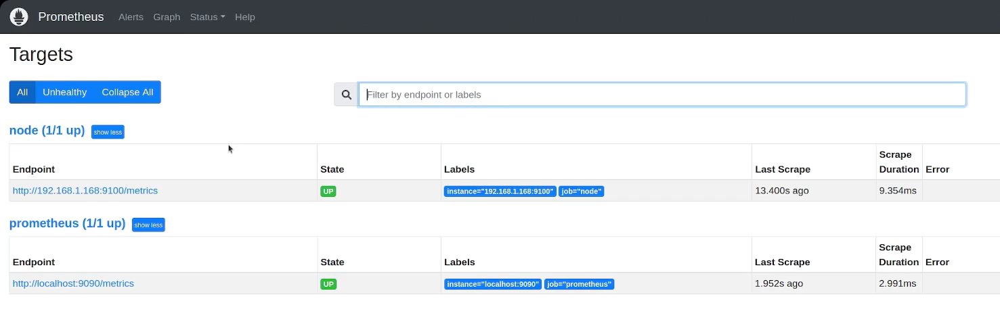

# Prometheus Tutorial


1. [Prometheus.yaml](#prometheus-configuration)
   1. [Global overview of Prometheus.yaml](#global-overview-of-prometheusyaml)
   2. [Scrape_configs](#scrape-configs)
2. [PromQl](#promql)
   1. [Label Matchers](#label-matchers)
   2. [Selectors](#selectors)


## Prometheus configuration
Prometheus stores as default this configuration under `/etc/prometheus` in `prometheus.yaml` file.

### Global overview of Prometheus.yaml:
```yaml
# Default parameters for all other config sections 
Global: 
  scrape_interval: 1m
  scrape_timeout: 10s

# Define targets & configs for metrics collection
scrape_configs:
  # Job : is a collection of instances that need to be scraped
  - job_name: 'node'
    # Configs for scrape job. Takes precedence over global config
    scrape_interval: 15s # override Global scrape_interval
    sample_limit: 1000
    # Set of targets to scrape
    static_configs:
      - targets: ['172.0.0.1:9090']

# Configuration related to AlertManager
alerting:

# Rule files specifies a list of files rules are read from
rule_files:

# Settings related to the remote read/write feature.
remote_read:
remote_write:

# Storage related settings
storage:
```
**Promtool**: a tool helps you verify if the configuration is valid or not, before submitting it
```shell
promtool check config /etc/prometheus/prometheus.yml
```

### Scrape Configs
`scrape_configs` is a collection of `Jobs`. Each job represents a set of targets that Prometheus will scrape metrics from. 
**Parameters:**
- `job_name`: A unique name for the job that identifies the set of targets. This is useful for organizing and querying metrics. (Optional)
- `scrape_interval`: The frequency at which metrics are scraped. It defines how often Prometheus will pull metrics from the targets. Default: `1m`. Example: `30s`. (Optional)
- `scrape_timeout`: The maximum duration allowed for a scrape operation. If the scrape exceeds this time, it will be aborted. Default: `10s`. Example: `3s`(Optional)
- `metrics_path`: Specifies the **endpoint** where Prometheus should **scrape** metrics. The default value is `/metrics`. Example: `/stats/metrics`.(Optional)
- `scheme`: The **URL protocol** type to use for scraping. Possible values are `http` or `https`. Default: `http`. (Optional)
- `static_configs`:  Defines the static **list of targets** to be **scraped**. This configuration is used when the list of targets is fixed and does not change dynamically.
- `targets`:  A list of endpoints `(host:port)` from which Prometheus will scrape metrics. Example: `['10.231.1.2:9090', '192.231.0.1:9090']`.
- `basic_auth`: Configures basic authentication for targets that require credentials. (Optional)
  - `username`: The username for authentication. 
  - `password`: The password for authentication (not recommended for sensitive information). 
  - `password_file`: Path to a file containing the password (preferred for sensitive information).
- `tls_config`: Configures TLS settings if the target requires secure communication. (Optional)
    - `ca_file`: Path to the Certificate Authority (CA) file.
    - `insecure_skip_verify`:  Whether to skip verification of the server's certificate. Default: `false`.
```yaml
scrape_configs:
  - job_name: 'node' # Name of the job
    scrape_interval: 30s # Scrape metrics every 30 seconds
    scrape_timeout: 3s # Timeout for each scrape
    scheme: https # Use HTTPS protocol for scraping
    tls_config: # TLS configuration for secure targets
      ca_file: /etc/prometheus/node_exporter.crt
      insecure_skip_verify: true
    metrics_path: /stats/metrics # Custom metrics path
    static_configs:
      - targets:  # List of targets to scrape
          - '10.231.1.2:9090' 
          - '192.231.0.1:9090'
    basic_auth:                # Authentication settings
      username: 'user1'
      password: 'securepassword'  # Example password (not recommended in plaintext)
      password_file: '/etc/prometheus/secrets/password'  # Use file for sensitive info
```
**Note:** You need to restart prometheus after changing this file, Prometheus will not take the changes dynamically:
    `systemctl restart prometheus`



## PromQl
#### Label Matchers
-  `=`: Exact match on a Label value (e.g. `node_filesystem_avail_bytes{instance="node1"}`)
-  `!=`: Negative equality matcher (e.g. `node_filesystem_avail_bytes{device!="tmpfs"}`)
-  `=~`: Regular expression matcher - matches time series with labels that match regex (e.g. `node_filesystem_avail_bytes{device=~"/dev/sda.*"}`)
-  `!~`: Negative regular expression matcher (e.g. `node_filesystem_avail_bytes{mountpoint!~"/boot.*"}`)
#### Selectors
- Range Vector selector: Returns all the values for a metric over a period of time: `node_arp_entries{instance="node1"}[2m]`
#### Modifiers
- `offset`: Specifies a value of the metric from a given time ago. For example, `node_memory_Active_bytes{instance="node1"} offset 5m` retrieves the memory active bytes metric for node1 from 5 minutes ago.
    