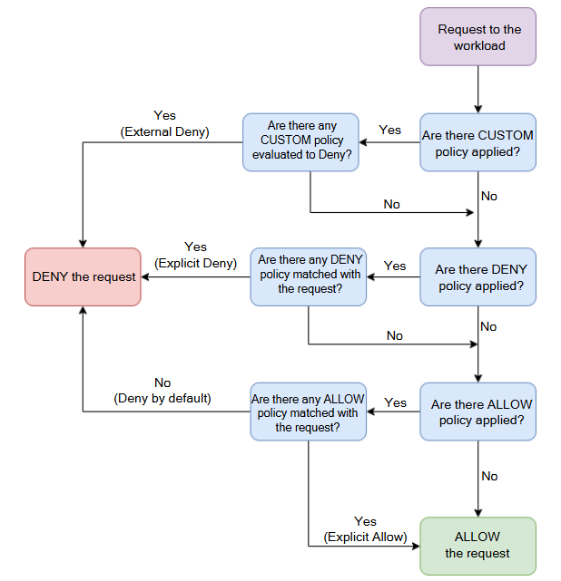

# Istio Security Tutorial    

## Authentication
Peer authentication is used to verify the identity of workloads within a service mesh. It enables workload-to-workload authentication using mutual TLS (mTLS).

### PeerAuthentication Policy
The PeerAuthentication resource defines how traffic will be tunneled (or not) to the sidecar proxy.
There is three types:
- `workload-specific policy`: Apply to the services matches the selector.
- `namespace-wide policy`: Apply to all the services in the specified namespace.
- and `mesh-wide policy`: apply to all the namespaces that have istio injection enabled.

**Workload-specific policy:** using the selector field to specify the workloads to apply the policy to.
```yaml
apiVersion: security.istio.io/v1beta1
kind: PeerAuthentication
metadata:
  name: default
  namespace: foo
spec:
  selector:
    matchLabels:
      app: example-app
  mtls:
    mode: STRICT
```
**Namespace-wide policy:** u only need to specify the namespace without the selector field.
```yaml
apiVersion: security.istio.io/v1beta1
kind: PeerAuthentication
metadata:
  name: default
  namespace: foo
spec:
  mtls:
    mode: STRICT
```
**Mesh-wide policy:** by specifying the **istio-system** as namespace.
```yaml 
apiVersion: security.istio.io/v1beta1
kind: PeerAuthentication
metadata:
    name: default
    namespace: istio-system
spec:
  mtls:
    mode: STRICT
```
### Mutual TLS (mTLS) modes

The resource that configures what type of mTLS traffic the sidecar accepts is PeerAuthentication. It supports four operating modes, as shown below:
- `UNSET`: Setting is inherited from the parent (e.g., mesh or namespace level settings); otherwise defaults to permissive mode 
- `DISABLE`: mTLS is disabled
- `PERMISSIVE (default)`: Connection between the workloads can either be plaintext or mTLS
- `STRICT`: Connection between workloads must be mTLS (i.e., both parties must present certificates)

The default mTLS mode is `PERMISSIVE`, which means that if a client tries to connect to a service via mTLS, the Envoy proxy will serve mTLS. The server will respond in plain text if the client uses plain text. With this setting, we are allowing the client to choose whether to use mTLS or not. The permissive mode is useful when onboarding existing applications to the service mesh as it allows us to roll out mTLS to all workloads gradually.

Once all applications are onboarded, we can turn on the `STRICT` mode. The strict mode says that workloads can only communicate using mTLS. The connection will be closed if a client tries to connect without presenting their certificate.

We can configure the mTLS mode at the mesh, namespace, workload, and port level. For example, we can set the STRICT mode at the namespace level and then individually set permissive mode or disable mTLS at either workload level using selectors or at the individual port level.


## Authorization
Authorization is used to control access to resources within a service mesh. 
The AuthorizationPolicy resource defines how traffic will be authorized to the sidecar proxy. it supports four actions: ALLOW, DENY, CUSTOM, and AUDIT.
- **ALLOW**: Allow all requests that mathches a rule.
- **DENY**: deny all requests that mathches a rule.
- **CUSTOM**: if we wanted to integrate a custom external authorization system to delegate the authorization decisions to it. Note that the CUSTOM action is experimental, so it might break or change in future Istio versions
- **AUDIT**:  can be used to audit a request that matches the rules. If the request matches the rules, the `AUDIT` action `triggers logging` that request. This action doesn’t affect whether the requests are allowed or denied.

NOTE: If we set any authorization policies, everything will be allowed. However, requests that do not conform to the allow policy rules will be denied as soon as we set any ALLOW policies

Example configuration:
```yaml	
apiVersion: security.istio.io/v1beta1
kind: AuthorizationPolicy
metadata:
  name: default
  namespace: foo
spec:
  selector: # (Optional)
    matchLabels:
      app: reviews 
  action: DENY
  rules:
    - from:
        - source:
            namespaces: ["bar"] # (Optional)
            principals: ["cluster.local/ns/bar/sa/bookinfo-productpage"] # (Optional) to specify wich service his Get requests will be denied
      to:
        - operation:
            methods: ["GET"]
```
=> This policy will deny **Get** requests from the **bar** namespace to the **foo** namespace.
By adding the **Selector**, the **Get** requests will be denied from the **bar** namespace to the **reviews** service in the **foo** namespace.  

### From field
Using the `from` field we can set the **source** identities of a request. The sources we can use are:
- principals(services)
- request principals(users)
- namespaces/notNamespaces
- IP blocks: 
- remote IP blocks 

 ```yaml
- from:
    - source:
        ipBlocks: ["192.168.1.1/24"]
    - source:
        notNamespaces: ["prod"]
    - source:
        requestPrincipals:
          - "horizon.io/mohamed"
```
=> The above rules would apply to sources coming from one of the `two IP addresses` that are not in the `prod` namespace and have the request principal set to `horizon.io/mohamed`.

### To field
The `to` field specifies the operations of a request. We can use the following operations:
- hosts
- ports
- methods
- paths

For each of the above, we can set the list of negative matches and combine them with the logical AND. 
For example:
 ```yaml
to:
  - operation:
      host: ["*.hello.com"]
      methods: ["DELETE"]
      notPaths: ["/admin*"]
```
=> The above operation matches if the `host` ends with `*.hello.com` and the method is `DELETE`, but the path doesn’t start with `/admin`.

### Conditions ("when" field)
With the when field, we can specify any additional conditions based on the Istio attributes. The attributes include:
- headers source  
- remote IP address
- auth claims
- destination port
- IP addresses
- and others.
For example:
```yaml
when:
  - key: request.auth.claims[iss]
      values: ["https://accounts.google.com"]
  - key: request.headers[User-Agent]
      notValues: ["curl/*"]
```
=> The above condition evaluates to true if the `iss` claim from the authenticated JWT equals the provided value and the `User-Agent` header doesn’t start with `curl/`.

### OverAll
```yaml
apiVersion: security.istio.io/v1beta1
kind: AuthorizationPolicy
metadata:
  name: default
  namespace: foo
spec:
  action: 
  rules:
  - from:
    to:
    when:
```
### How Are Rules Evaluated?
If we set any authorization policies, everything will be allowed. However, requests that do not conform to the allow policy rules will be denied as soon as we set any ALLOW policies.

The rules get evaluated in the following order:

- **CUSTOM policies**: are evaluated first.
- **DENY policies**: are evaluated next.
- **ALLOW policies**: are evaluated last.

If we have multiple policies defined, they are aggregated and evaluated, starting with the `CUSTOM policies`. So, if we have two rules - one for ALLOW and one for DENY, the DENY rule will be enforced. If we use all three actions, the `CUSTOM`   action is evaluated first. 

Assume we have defined policies that use all three actions. We will evaluate the `CUSTOM` policies and then deny or allow the request based on that. Next, the `DENY` policies matching the request get evaluated. If we get past those, and if there are no `ALLOW` policies set, we will allow the request. If any `ALLOW` policies match the request, we will also allow it. If they do not, the request gets denied. 

**Authorization policy precedence flowchart:**  
<p align="center">
  
</p>

A good practice is to create a policy denying all requests. Once we have that in place, we can create individual ALLOW policies and explicitly allow communication between services

Deny All Policy:
```yaml
apiVersion: security.istio.io/v1beta1
kind: AuthorizationPolicy
metadata:
  name: deny-all
  namespace: default
spec:
  {}
```


