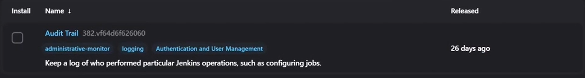
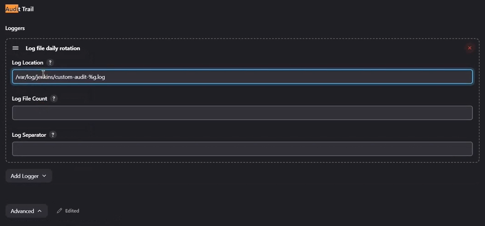
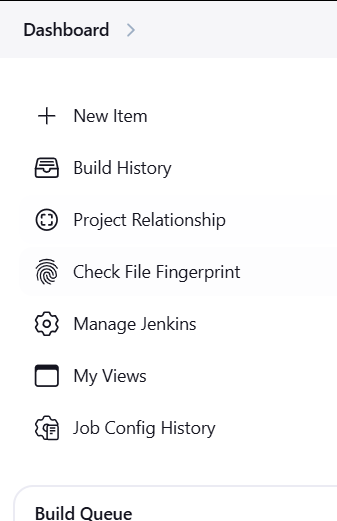
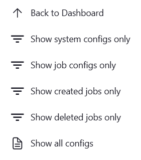
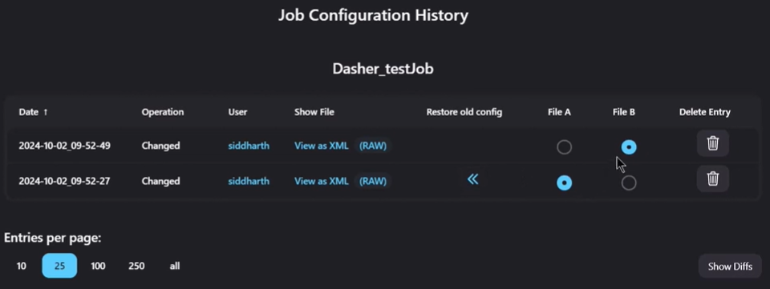
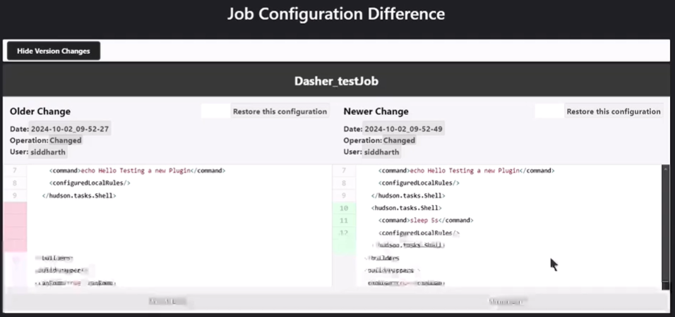
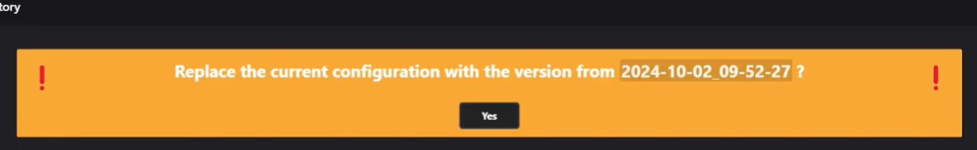

# Jenkins Administration


1. [Monitoring](#monitoring)
2. [Log Recorder](#log-recorder)
3. [Audit Trail](#audit-trail)
4. [Migrate Jenkins to another Node](#migrate-jenkins-to-another-node)
5. [Job Config History: Recovery and Rollback](#job-config-history-recovery-and-rollback)


## Monitoring 

### Requirements
- Jenkins Prometheus plugin installed
- Prometheus server
- Grafana server (for visualization)

### Prometheus Plugin Configuration

The Prometheus plugin exposes various Jenkins metrics that can be scraped by Prometheus. Here are the key configuration options:

#### Basic Configuration
1. Access the configuration through: `Manage Jenkins` > `Configure System` > `Prometheus`
2. Default endpoint: `http://your-jenkins-url/prometheus`

#### Metric Types Available
1. **System Metrics**
   - Jenkins version
   - System load
   - Memory usage
   - CPU usage
   - Disk usage

2. **Job Metrics**
   - Build counts
   - Build duration
   - Build status
   - Queue length
   - Job health

3. **Plugin Metrics**
   - Plugin versions
   - Plugin health status

#### Configuration Options
```yaml
# Example prometheus.yml configuration
scrape_configs:
  - job_name: 'jenkins'
    metrics_path: '/prometheus'
    scheme: http # https if jenkins url uses https
    static_configs:
      - targets: ['jenkins:8080']
    scrape_interval: 15s
```

### Grafana Dashboard Setup

1. **Installation**
   ```bash
   # Using Docker
   docker run -d \
     -p 3000:3000 \
     --name grafana \
     grafana/grafana
   ```

2. **Configuration**
   - Access Grafana at `http://localhost:3000`
   - Add Prometheus as a data source:
     - URL: `http://prometheus:9090`
     - Access: `Server (default)`

3. **Recommended Dashboards**
   - Jenkins Overview (ID: 9964)
   - Jenkins Build Statistics (ID: 9965)
   - Jenkins System Metrics (ID: 9966)

### Key Metrics to Monitor

1. **System Health**
   - Memory usage
   - CPU utilization
   - Disk space
   - Response time

2. **Build Performance**
   - Build success rate
   - Average build duration
   - Queue length
   - Failed builds

3. **Resource Utilization**
   - Executor usage
   - Queue size
   - Plugin health
   - System load

### Alerting Setup

1. **Configure Alert Rules in Prometheus**
   ```yaml
   groups:
   - name: jenkins_alerts
     rules:
     - alert: HighBuildFailureRate
       expr: rate(jenkins_builds_failed_total[5m]) > 0.1
       for: 5m
       labels:
         severity: warning
       annotations:
         summary: High build failure rate
         description: Build failure rate is above 10% for 5 minutes
   ```

2. **Grafana Alerting**
   - Set up alert rules in Grafana dashboards
   - Configure notification channels (email, Slack, etc.)
   - Define alert thresholds based on your requirements

### Best Practices

1. **Monitoring Setup**
   - Set appropriate scrape intervals (15s recommended)
   - Use appropriate retention periods
   - Implement proper authentication

2. **Dashboard Organization**
   - Create separate dashboards for different aspects
   - Use variables for dynamic filtering
   - Implement proper refresh intervals

3. **Alerting**
   - Set meaningful thresholds
   - Use appropriate alert severity levels
   - Implement proper notification routing

4. **Performance**
   - Monitor Prometheus and Grafana resource usage
   - Optimize metric collection
   - Regular cleanup of old data

## Log Recorder

The Log Recorder is a powerful debugging tool in Jenkins that allows you to monitor and track specific logging output from different components of Jenkins. It helps in troubleshooting issues by providing detailed logs for specific packages or components.

> **⚠️ Important Note**: Log Recorders should only be used temporarily for debugging purposes. Excessive logging can impact Jenkins performance and consume disk space. Always remove loggers once debugging is complete.

### When to Use Log Recorder

- Debugging plugin issues
- Investigating build failures
- Monitoring specific Jenkins components
- Troubleshooting integration problems
- Performance analysis

### Setting Up a Log Recorder

1. Navigate to **Manage Jenkins** > **System Log**
2. Click **Add New Log Recorder**
3. Enter a descriptive name (e.g., `kubernetes-plugin-logs`, `pipeline-execution-debug`)
4. Click **Create**
5. In the Logger configuration section:
   - **Logger**: Enter the Java package name to monitor
   - **Log Level**: Select the appropriate logging level
   
#### Example Logger Configurations

| Component | Logger Name | Recommended Log Level |
|-----------|------------|---------------------|
| Kubernetes Plugin | `io.fabric8.kubernetes` | FINE or INFO |
| Pipeline | `org.jenkinsci.plugins.workflow` | FINE |
| Git Plugin | `hudson.plugins.git` | DEBUG |
| Jenkins Security | `hudson.security` | WARNING |

#### Logging Levels (from least to most verbose)
- **SEVERE**: Only critical issues
- **WARNING**: Potentially harmful situations
- **INFO**: General information
- **FINE**: Detailed information
- **FINER**: More detailed debugging
- **FINEST**: Most detailed debugging

### Viewing Logs

1. Go to **Manage Jenkins** > **System Log**
2. Click on your Log Recorder name
3. The logs will be displayed in chronological order
4. Use the **Clear this log** button to reset the log output

### Managing Log Recorders

#### Temporary Pause
To temporarily disable logging without deleting the configuration:
1. Go to the Log Recorder configuration
2. Change the Log Level to **OFF**
3. Click **Save**

#### Permanent Removal
When debugging is complete:
1. Navigate to **Manage Jenkins** > **System Log**
2. Click the configuration (⚙️) icon next to your Log Recorder
3. Click **Clear this log** to remove existing entries
4. Click the three dots (⋮) menu
5. Select **Delete Log Recorder**

### Best Practices

1. **Naming Convention**: Use descriptive names that include:
   - Component being debugged
   - Issue type
   - Date (if relevant)
   Example: `kubernetes-auth-issues-20240315`

2. **Log Level Selection**:
   - Start with WARNING or INFO
   - Only increase verbosity if needed
   - Avoid FINEST level in production unless absolutely necessary

3. **Maintenance**:
   - Regularly review and remove unused Log Recorders
   - Document the purpose of long-running Log Recorders
   - Set calendar reminders to clean up debugging logs

4. **Security Considerations**:
   - Avoid logging sensitive information
   - Restrict access to Log Recorders to admin users
   - Regularly rotate logs if keeping them for extended periods

## Audit Trail

Jenkins Audit Trail plugin provides comprehensive logging of user actions and system changes, helping maintain security compliance and troubleshoot unauthorized changes.

### Overview

The Audit Trail plugin tracks various actions including:
- Configuration changes
- Job creation/deletion/modification
- Build triggers and results
- User authentication events
- System configuration updates

### Prerequisites

1. **Plugin Installation**:
   - Install "Audit Trail Plugin" from Jenkins Plugin Manager
   - Navigate to **Manage Jenkins** > **Manage Plugins** > **Available**
   - Search for "Audit Trail" and install

<p align="center">
    
</p>

### Supported Logging Formats

1. **Console Output**
   - Direct logging to Jenkins console
   - Useful for development/testing
   - Not recommended for production

2. **Log File**
   - Single file logging
   - Simple setup
   - Manual rotation needed

3. **Log File Daily Rotation**
   - Automatic daily log rotation
   - Configurable retention
   - Recommended for most installations

4. **Elasticsearch Server**
   - Structured logging
   - Advanced search capabilities
   - Scalable solution

5. **Syslog Server**
   - Standard syslog protocol
   - Integration with existing log infrastructure
   - Centralized logging

### Configuration Steps

1. Navigate to **Manage Jenkins** > **System** > **Audit Trail**
2. In the **Loggers** section, click **Add Logger**
3. Select your preferred logging format

#### Log File Daily Rotation Configuration (Recommended)

<p align="center">
    
</p>

**Key Settings**:
- **Log Location**: `/var/log/jenkins/audit-%g.log` (% is placeholder for rotation number)
- **Max Log Size**: `50` (MB, recommended)
- **Max Log Files**: `10` (keeps last 10 rotated files)
- **Pattern**: `(.*)` (captures all events)
- ✓ **Display Username instead of UserId** (recommended for readability)

### Forward Audit logs to External server (ELK Stack Integration)

For sending audit logs to ELK (Elasticsearch, Logstash, Kibana), configure the Audit Trail plugin as follows:

```yaml
Logger Type: Log File Daily Rotation
Log Location: /var/log/jenkins/audit-trail/jenkins-audit-%g.log
Max Log Size (MB): 10
Max Log Files: 10
Pattern: (.*)
```

> **Note**: For detailed ELK stack setup and configuration, refer to the official documentation:
> [ELK Stack Documentation](https://www.elastic.co/guide/index.html)

### Best Practices

1. **Log Retention**:
   - Keep logs for compliance requirements (e.g., 90 days)
   - Configure appropriate rotation settings
   - Monitor disk space usage

2. **Security**:
   - Protect log files with appropriate permissions
   - Use secure transport for remote logging
   - Regular backup of audit logs

3. **Performance**:
   - Monitor log size and growth rate
   - Adjust rotation settings based on usage
   - Consider log aggregation for large installations

4. **Monitoring**:
   - Regular log review
   - Set up alerts for suspicious activities
   - Periodic audit compliance checks


### Troubleshooting

Common issues and solutions:

1. **Missing Logs**:
   - Verify file permissions
   - Check log path exists
   - Ensure sufficient disk space

2. **Performance Impact**:
   - Reduce log verbosity
   - Increase rotation frequency
   - Optimize pattern matching

3. **Log Rotation Issues**:
   - Verify write permissions
   - Check available disk space
   - Confirm rotation pattern syntax

### Monitoring Audit Logs

1. **Regular Checks**:
   ```bash
   # Quick view of recent activities
   tail -f /var/log/jenkins/audit.log
   
   # Search for specific user actions
   grep "user:admin" /var/log/jenkins/audit.log
   
   # Find configuration changes
   grep "config.xml" /var/log/jenkins/audit.log
   ```

2. **Important Events to Monitor**:
   - Configuration changes
   - Permission modifications
   - Failed login attempts
   - Job deletions
   - Pipeline modifications


## Migrating Jenkins to Another Node

This guide details the process of migrating a Jenkins instance to a new server while ensuring data integrity and minimal downtime.

### Prerequisites

1. **Source Node Requirements**:
   - Access to source Jenkins server
   - Sufficient disk space for backup
   - Root or sudo access

2. **Target Node Requirements**:
   - Jenkins installed with same version
   - Sufficient disk space (2x current Jenkins size)
   - Root or sudo access
   - Required plugins pre-installed

3. **Before Migration**:
   - [ ] Document current Jenkins version
   - [ ] List installed plugins
   - [ ] Note any custom configurations
   - [ ] Verify target node meets system requirements
   - [ ] Plan for downtime window
   - [ ] Backup existing data

### Migration Process

#### 1. Preparation Steps (Source Node)

```bash
# Check Jenkins version for reference
jenkins --version

# Check disk space requirements
du -sh /var/lib/jenkins

# List installed plugins (save this for verification)
ls -la /var/lib/jenkins/plugins/
```

#### 2. Stop Jenkins Services (Source Node)

```bash
# Stop Jenkins service
sudo systemctl stop jenkins

# Verify Jenkins is stopped
sudo systemctl status jenkins

# Disable Jenkins service to prevent auto-start
sudo systemctl disable jenkins
```
#### 3. Backup Jenkins Data (Source Node)

```bash
# Navigate to /var/lib
cd /var/lib

# Create backup with timestamp
BACKUP_NAME="jenkins-backup.tar.gz"
sudo tar zcfv $BACKUP_NAME jenkins/ \
    --exclude='jenkins/workspace/*' \
    --exclude='jenkins/caches/*' \
    --exclude='jenkins/logs/*'

# Verify backup size and integrity
ls -lh $BACKUP_NAME
tar tzf $BACKUP_NAME | head -n 5
```   
#### 4. Transfer Backup (Source to Target)

```bash
# Using SCP (replace with your target node details)
sudo scp jenkins-backup.tar.gz root@<target-node-ip>:/tmp/jenkins-backup.tar.gz

# Alternative using RSYNC (more reliable for large files)
sudo rsync -avz --progress $BACKUP_NAME root@<target-node-ip>:/tmp/
```
#### 5. Restore on Target Node  

```bash
# Stop Jenkins if running on target
sudo systemctl stop jenkins

# move the tar file to /var/lib
mv /tmp/jenkins-backup.tar.gz /var/lib

# Navigate to /var/lib
cd /var/lib

# Backup existing Jenkins directory if exists
if [ -d "jenkins" ]; then
    sudo mv jenkins jenkins.old
fi


# Extract backup
sudo tar xzfv jenkins-backup.tar.gz

# make sure that the user and group owners of the jenkins folder are jenkins jenkins
ll

# Set correct ownership
sudo chown -R jenkins:jenkins jenkins

# Verify permissions
ls -la jenkins/
```

#### 6. Start Jenkins on Target Node

```bash
# Enable Jenkins service
sudo systemctl enable jenkins

# Start Jenkins
sudo systemctl start jenkins

# Monitor logs for startup
sudo tail -f /var/log/jenkins/jenkins.log
```
### Post-Migration Verification

1. **System Check**:
   ```bash
   # Check Jenkins service status
   sudo systemctl status jenkins
   
   # Check for errors in logs
   sudo tail -f /var/log/jenkins/jenkins.log
   
   # Verify process is running
   ps aux | grep jenkins
   ```

2. **Application Check**:
   - [ ] Access Jenkins web interface
   - [ ] Verify all jobs are present
   - [ ] Check plugin functionality
   - [ ] Test build triggers
   - [ ] Verify system configurations
   - [ ] Test agent connections

### Troubleshooting Common Issues

1. **Jenkins Fails to Start**:
   ```bash
   # Check for permission issues
   sudo ls -la /var/lib/jenkins
   sudo chown -R jenkins:jenkins /var/lib/jenkins
   
   # Check for port conflicts
   sudo netstat -tulpn | grep 8080
   ```

2. **Missing Plugins**:
   ```bash
   # Verify plugin directory
   ls -la /var/lib/jenkins/plugins/
   
   # Check plugin permissions
   sudo chown -R jenkins:jenkins /var/lib/jenkins/plugins/
   ```

### Best Practices

1. **Backup Strategy**:
   - Create regular backups before migration
   - Keep multiple backup copies
   - Verify backup integrity
   - Document backup contents

2. **Security Considerations**:
   - Update Jenkins URL configurations
   - Review security settings
   - Update SSL certificates if needed
   - Reset sensitive credentials

3. **Performance Optimization**:
   - Clean up old workspaces
   - Archive unused jobs
   - Remove unnecessary plugins
   - Optimize JVM settings

### Rollback Plan

If migration fails:

1. Stop Jenkins on target node:
   ```bash
   sudo systemctl stop jenkins
   ```

2. Restore original Jenkins on source node:
   ```bash
   sudo systemctl enable jenkins
   sudo systemctl start jenkins
   ```

3. Document issues encountered for future attempts

### Additional Considerations

1. **For Large Installations**:
   - Consider incremental migration
   - Plan for extended downtime
   - Test with subset of jobs first
   - Monitor system resources

2. **Network Considerations**:
   - Update DNS records
   - Configure firewalls
   - Update load balancers
   - Modify backup scripts

3. **Documentation**:
   - Update system documentation
   - Record new IP/hostname
   - Update monitoring configs
   - Modify backup schedules

### Related Resources

- [Jenkins Backup Plugin Documentation](https://plugins.jenkins.io/backup/)
- [Jenkins Administration Guide](https://www.jenkins.io/doc/book/managing/)
- [Security Considerations](https://www.jenkins.io/doc/book/security/)

## Job Config History: Recovery and Rollback 

### Rollback Job and system configuration
- `Job Configuration History plugin`: This plugin allows you to **view the history of job and system configurations**, and **revert** to a previous configuration.
doc: [Job Configuration History plugin](https://plugins.jenkins.io/jobConfigHistory/) 

How to use:
1. Install the plugin through Jenkins Plugin Manager
2. After installing, `Job Config History` will be available in the Jenkins Dashboard and job configuration page:

<p align="center">
    
</p>

3. Click on `Job Config History` to access the history view
4. Use the filters in the left sidebar to narrow down your search:
   - `Show system configs only`: View only system-wide configuration changes
   - `Show job configs only`: View changes made to job configurations
   - `Show created jobs only`: View newly created jobs
   - `Show deleted jobs only`: View removed jobs
   - `Show all configs`: Display all configuration changes
   <p align="center">
    
   </p>

5. To view a specific configuration change, click on `Show Diffs` button (additions in green, deletions in red)


6. To restore a previous configuration:
   - Navigate to the desired version
   - Click the `>>` button or the `Restore this configuration` in the `diff view`	
   - Confirm the restoration when prompted
   
   
