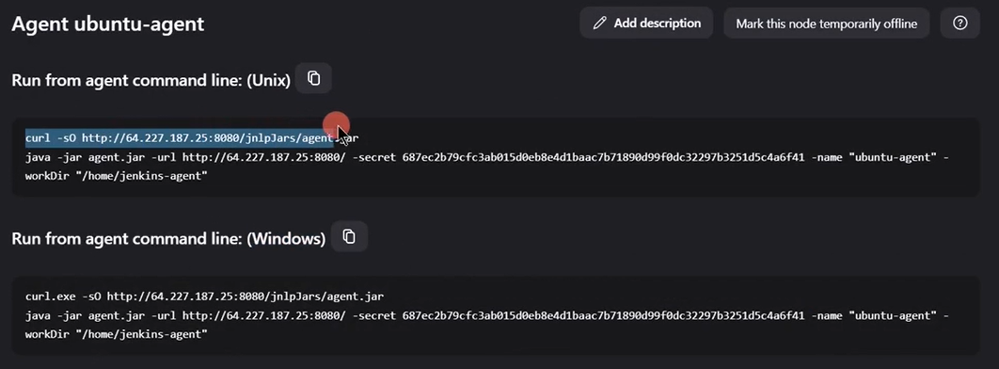

# Jenkins Agents and Nodes Guide

1. [Setting Up Permanent Agent](#setting-up-permanent-agent)
2. [Utiliz Docker Agents](#utiliz-docker-agents) 
    1. [Utilize a Docker Image Agent](#utilize-a-docker-image-agent)
    2. [Utilize a Dockerfile Agent](#utilize-a-dockerfile-agent)
    3. [Utilize newContainerPerStage Agent](#utilize-newcontainerperstage-agent)
3. [Configure Cloud Instances (Kubernetes)](#configure-cloud-instances-kubernetes)
## Types of Agents

- **Permanent Agents**: Dedicated machines that stay continuously connected to Jenkins
- **Cloud Agents**: Dynamically provisioned on-demand and removed when no longer needed
- **Docker Agents**: Run jobs inside Docker containers
- **Kubernetes Agents**: Run jobs as pods in a Kubernetes cluster

## Setting Up Permanent Agent 

### Prerequisites
- Server/VM with network access
- Java installed on the agent machine

### Configuration Steps
1. Go to **Manage Jenkins > Nodes and Clouds > New Node**
2. Enter a node name, select **Permanent Agent**, and click **Create**
3. Configure the node:
   - **Number of executors**: How many concurrent jobs can run (typically match CPU cores)
   - **Remote root directory**: Where Jenkins will store job files (e.g., `/home/jenkins-agent`)
   - **Labels**: Tags to target this agent (e.g., `linux-docker-jdk17-node20-agent`)
   - **Usage**: Choose "Use this node as much as possible" for dedicated agents
   - **Launch method**: "Launch agent by connecting it to the controller"
   - **Availability**: "Keep this agent online as much as possible"
   - **Disk space monitoring**:
     - Free Disk Space Threshold: 1GiB
     - Free Disk Space Warning Threshold: 2GiB
     - Free Temp Space Threshold: 1GiB
     - Free Temp Space Warning Threshold: 2GiB
4. Click **Save**

### Connecting the Agent
1. Enable TCP connection: 
   - Go to **Manage Jenkins > System > Agents**
   - Choose Random or Fixed port
   - Apply changes
2. Click on the agent name to see connection instructions
   <p align="center">
    
   </p>
3. Run the provided command on your agent machine
   
## Utiliz Docker Agents 

### Utilize a Docker Image Agent 
In Jenkinsfile:
```groovy
agent{
    docker{
        image: 'node:18-alpine'
        label: 'linux-docker-jdk17-node20-agent' // Label of a VM that has Docker installed
    }
} 
```
### Utilize a Dockerfile Agent
In Jenkinsfile:
```groovy
agent{
    dockerfile{
        filename: 'Dockerfile'
        label: 'linux-docker-jdk17-node20-agent' // Label of a VM that has Docker installed
    }
} 
```
### Utilize newContainerPerStage Agent
In Jenkinsfile:
```groovy
options{
    newContainerPerStage()
}
```

**Tip**: Use the "Pipeline Syntax" generator in Jenkins to create more advanced Docker agent configurations. Go to your pipeline job and click on "Pipeline Syntax" to access this tool.
**Note**: If you don't specify the label, it will take the agent declared globaly

## Configure Cloud Instances (Kubernetes)
### Prerequisites
- Kubernetes cluster
- RBAC permissions configured
- Kubernetes Plugin Installed : 
<p align="center">
    
</p>

### Configuration Steps
1. Go to **Manage Jenkins > Clouds > New Cloud**
2. Enter a Cloud name, select Type **Kubernetes**, and click **Create**
3. Configure the Cloud:
   There is two ways to connect to the kuberentes cluster:
   - By passing Kube Config file: **(NOT Recommended)**
     - Run:  
        ```bash 
        kubectl config view --raw
        ``` 
     - Copy the entire logs and saved in yaml file (e.g., kubeconfig.yaml)
     - Click `Add Credentails`, choose type `Secret file`, Click Choose file and pick the file you saved it earlier
     - Give it and ID and Description (Optional), and Click save. 
     - In credentails, select the new Created kubeconfig creds, Click Test Connection, It should print similar to this : "Connected to kubernetes v1.29.9" 
     - **Aware**: This type of connections is not recommended, because it has the Admin privileges, which have access to all the cluster, For best practicies and Least Privilege Principle Follow The way specified in the following steps.
   - **Kubernetes URL**: 
        - Run:  
        ```bash 
        kubectl config view --raw
        ```
        - Copy the the URL in `cluster.servise`
   - **Kubernetes Namespace**: 
        - Create a namespace for jenkins in the kubernetes cluster:
        ```bash 
        kubectl create namespace jenkins
        ```
        - Choose the name as "jenkins"
   - **Kubernetes server certificate key**: This certificate for HTTPS connections, if you don't have one, just Check `Disable https certificate check`
   - Create a Service account: jenkins need a service account to be able to connect to the cluster: 
        - create a service account
        ```bash 
        kubectl -n jenkins create sa jenkins-service-account
        ```
        - create a secret or a token and associated to this service account
        ```bash 
        kubectl -n jenkins create token jenkins-service-account --duration 9999999s
        ```
        by default, the duration is 1 hour
        - Copy the token and create credentials type `Secret text`, give it and ID and paste the token.
        - Select the credentials that you created it earlier
        - Create a Role Biding: jenkins will not be able to connect to the cluster until this service account is associated with a RoleBinding:
        ```bash 
        kubectl -n jenkins create rolebinding jenkins-admin-biding --clusterrole=admin --serviceaccount=jenkins:jenkins-service-account --duration 9999999s
        ```
        - To verify click `Test Connection` 
        - **Note**: By default, It uses the TCP (jnlp) connection, if this Type of connection is disabled it will show a warning under `Websocket` and `Direct Connection` Checkbox.
        - Additional Config: you can specify also the 
            - Jenkins URL, Jenkins Tunnel (Port), Pod Labels (key-value pairs), Pod Retention
4. Click **Save**
### Utilize Kubernetes Pod as Agent
Setup Pod Agent tempalte methods:
1. Add pod templates with appropriate labels and container settings
2.In Jenkinsfile :
```groovy
agent {
    kubernetes {
        cloud '<name-of-created-kubernetes-cloud>'
        yaml """
        apiVersion: v1
        kind: Pod
        spec:
          containers:
          - name: ubuntu-container
            image: ubuntu
            command:
            - sleep
            args:
            - infinity
        """
        defaultContainer 'ubuntu-container'
        retries 2
    }
}
```
**Note:** if you don't specify the cloud parameter, jenkins will use the first available kubernetes cloud.

**Tip:** Use the "Pipeline Syntax" generator in Jenkins to create more advanced Kubernetes agent configurations. Go to your pipeline job and click on "Pipeline Syntax" and search for "Kubernetes".

**Multiple Containers:**
In pod definition you can define multiple containers, and this containers shares the same volume by default
so all dependencies installed and files created in a container their are accessible by the other container, all you need to do is:
1. Add The containers descriptions in Pod Template: 
```groovy
agent {
    kubernetes {
        cloud '<name-of-created-kubernetes-cloud>'
        yaml """
        apiVersion: v1
        kind: Pod
        spec:
          containers:
          - name: ubuntu-container
            image: ubuntu
            command:
            - sleep
            args:
            - infinity
          - name: maven-container
            image: maven:3.8.6-openjdk-11-slim
            command:
            - sleep
            args:
            - infinity
        """
        defaultContainer 'ubuntu-container'
        retries 2
    }
}
```
2. in stage section:
```groovy
stage {
    steps {
        container('maven-container'){
            sh 'mvn version'
        }
    }
}
```
**Tip:** Instead of hard-coding the pod definition in jenkinsfile, it possible to define it in a yaml file and reference it in pod agent definition,
example:
```yaml
apiVersion: v1
kind: Pod
spec:
    containers:
    - name: ubuntu-container
    image: ubuntu
    command:
    - sleep
    args:
    - infinity
    - name: maven-container
    image: maven:3.8.6-openjdk-11-slim
    command:
    - sleep
    args:
    - infinity
```

```groovy
agent {
    kubernetes {
        cloud '<name-of-created-kubernetes-cloud>'
        yamlFile 'k8s-agent.yaml'
        defaultContainer 'ubuntu-container'
        retries 2
    }
}
```


## Best Practices
- **Use descriptive labels** to target the right agents for your jobs
- **Implement proper cleanup** for cloud and container agents
- **Monitor agent health** and performance regularly
- **Secure your agents** with the principle of least privilege
- **Document configurations** for your team