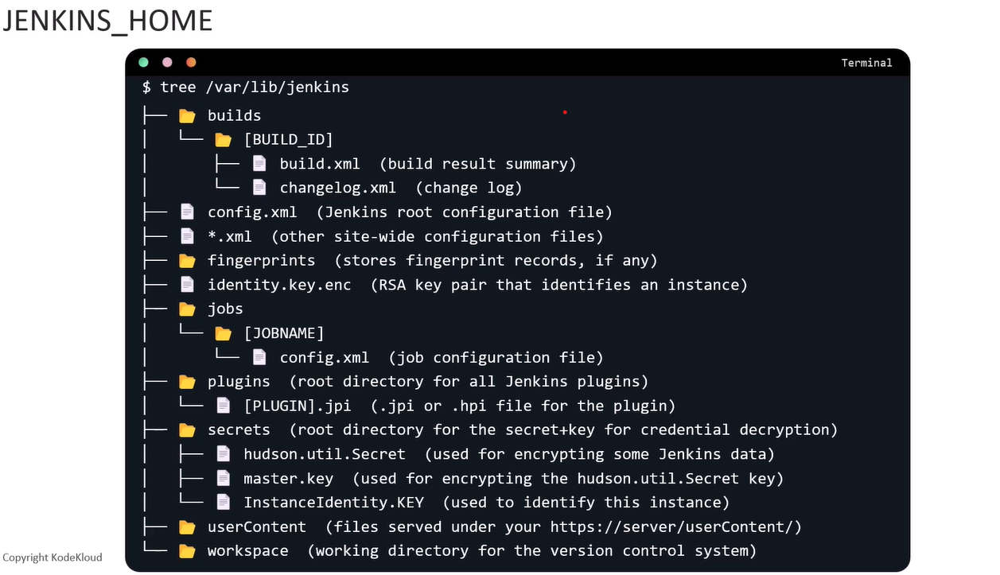
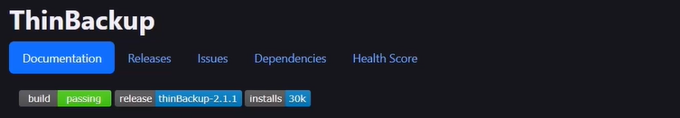
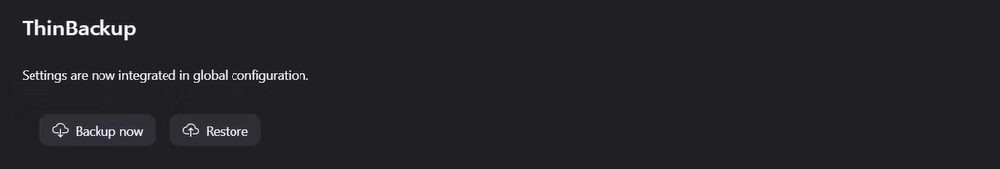
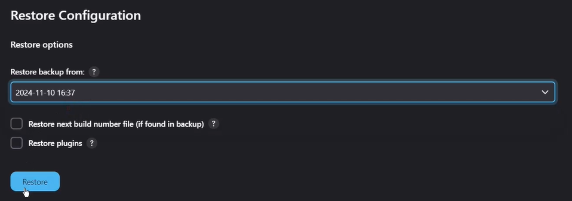

# Backup and Restore 

This guide provides detailed information about backing up and restoring Jenkins configurations and data to ensure system reliability and disaster recovery capabilities.

## Jenkins Home directory

The Jenkins home directory (`JENKINS_HOME`) is the central storage location for all Jenkins configurations, jobs, and runtime data. By default, it's located at:
- **Linux/Unix**: `/var/lib/jenkins`
- **Windows**: `C:\Program Files\Jenkins`
- **Docker**: `/var/jenkins_home`

    

While the Jenkins home directory contains all data, focusing on critical components ensures efficient backup strategies, Essential Components:
- **Main Configuration (`config.xml`)**: Contains global Jenkins configuration.
- **Job Configurations (`jobs/` folder)**: Contains all job definitions and configurations.
- **Plugin Configurations (`*.xml` files)** : Individual plugin settings.
- **Credentials and Security (`secrets/` folder)**: Contains encryption keys and credentials.
- **Plugins (`plugins/` folder)**: Not mandatory for backup as plugins can be reinstalled, consider instead backing up `plugins.txt` for version control.
- **User Content (`userContent/` folder)**: Custom static resources.

## Thinbackup plugin

The ThinBackup plugin provides an automated solution for Jenkins backup and restoration, offering both full and differential backup options to efficiently manage backup storage.

    

### Installation

1. Navigate to **Manage Jenkins** > **Manage Plugins** > **Available**
2. Search for "ThinBackup"
3. Select and install the plugin
4. Restart Jenkins when prompted (Not Mandatory)

### Configuration

Navigate to **Manage Jenkins** > **System** and locate the ThinBackup section:

**Basic Settings**:

- `Backup directory`: Path where the backup will be stored (e.g. var/lib/jenkins/JENKINS_BACKUP)
- `Backup schedule for full backups`:  Cron expression for complete backups
    - Example: `0 2 * * 0` (Every Sunday at 2:00 AM)
- `Backup schedule for differential backups`:  Cron expression for complete backups
    - Example: `0 2 * * 0` (Every Sunday at 2:00 AM)
- `Max number of backup sets`: Controls automatic cleanup of old backups
    - Recommended: `10-20` (depending on storage capacity)
- `File exculded from bakcup sets`: Regular expressions for files to exclude
  - Example: `.*\.log$` (Excludes all log files)
  - Example: `workspace/.*` (Excludes workspace content)
- `Force Jenkins to quiet mode after  specified minutes`: Minutes to wait before starting backup (default: 120), also it Pauses job execution during backup, 
- Other backup options:

    

**Note:** For first-time users, the default settings provide a good starting point, but customize backup schedules and retention based on your specific requirements and available storage.

### Manual Backup and Restore

    

**Performing Manual Backups:**

1. Navigate to **Manage Jenkins** > **ThinBackup**
2. Click **Backup now**

**Restoring from Backup:**

    

1. Navigate to **Manage Jenkins** > **ThinBackup**
2. Click **Restore**
3. Select the backup date to restore from the available backups
4. Click **Restore**
5. Restart Jenkins:  `<jenkins-url>/restart`

You can view the backup logs in Manage Jenkins > System logs > All Jenkins logs 