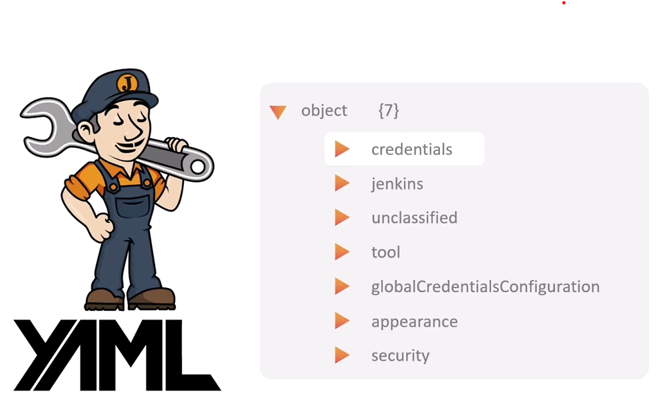

# Jenkins Configuration as Code (JCasC)

Jenkins Configuration as Code allows you to define your entire Jenkins configuration in a YAML file, enabling easier management, version control, and deployment of Jenkins configurations.

## Prerequisites

- Jenkins 2.150.1 or newer
- Configuration as Code plugin installed
- Basic understanding of YAML syntax

## Installation

1. Navigate to **Manage Jenkins** > **Manage Plugins** > **Available**
2. Search for "Configuration as Code"

    

        
    

3. Install the plugin and restart Jenkins

## Basic Configuration

Set up JCasC by specifying the configuration source in one of these ways:

1. **Environment Variable**: Set `CASC_JENKINS_CONFIG=/path/to/jenkins.yaml`
2. **System Property**: Use `-Dcasc.jenkins.config=/path/to/jenkins.yaml` when starting Jenkins
3. **Web UI**: Navigate to **Manage Jenkins** > **Configuration as Code** > Set configuration path

## YAML File Structure

    

### Key Components

The JCasC configuration file includes these primary sections:

- **jenkins**: Core Jenkins settings including system message, executors, security settings, and global properties
  
- **tool**: Tool configurations used by Jenkins such as Git, Maven, JDK, and other build tools
  
- **unclassified**: Plugin settings that don't fit into other categories, including location configuration, email settings, and cloud providers
  
- **jobs**: Job definitions using JobDSL syntax for pipelines, folders, and projects
  
- **credentials**: Credential definitions for various authentication needs like usernames/passwords, SSH keys, and tokens
  
- **security**: Advanced security configurations including CSRF protection and agent security settings

## Using Environment Variables

For sensitive information, use environment variables in your configuration:

1. Reference variables in the YAML file using `${VARIABLE_NAME}`
2. Set the environment variables before starting Jenkins
3. Use secrets files for more secure management

## Validating Configuration

Before applying, validate your configuration:

1. **Using UI**: Navigate to **Manage Jenkins** > **Configuration as Code** > **Configuration Check**
2. **Using CLI**: Use the Jenkins REST API to validate the configuration file

## Configuration file syntax

Documentation: [Github Jenkins jcasc Demos](https://github.com/jenkinsci/configuration-as-code-plugin/tree/master/demos) 

### Create a Job

**Requirements:** Job dsl plugin

    

