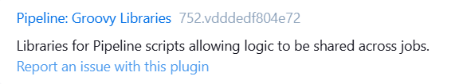
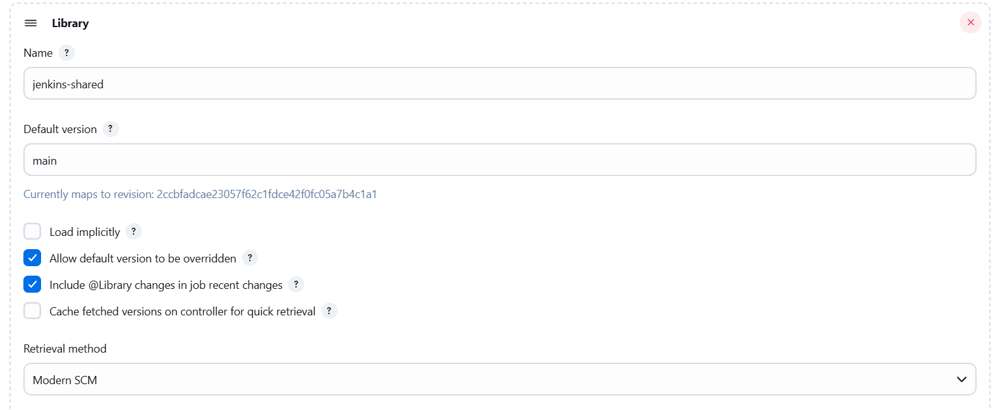
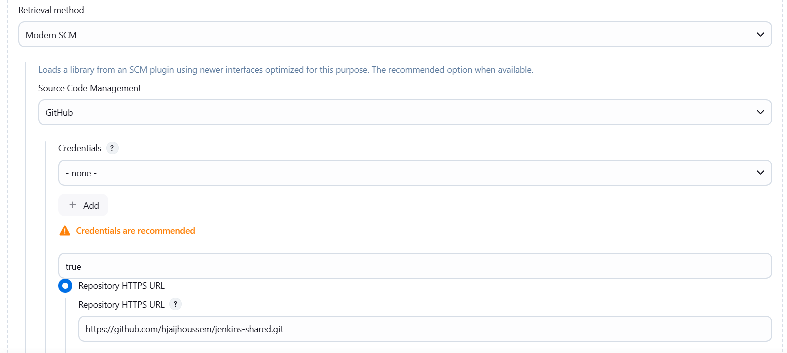

# Jenkins Shared Library

1. [Overview](#overview)
2. [Directory Structure](#directory-structure)
3. [Requirements](#requirements)
4. [Create a Shared Library](#create-a-shared-library)
5. [Configure Shared Library in Jenkins](#configure-shared-library-in-jenkins)
6. [Loading the Shared library in Jenkinsfile](#loading-the-shared-library-in-jenkinsfile)
7. [Resources Directory](#resources-directory)
8. [Best Practices](#best-practices)
9. [Dynamic Loading](#dynamic-loading)

## Overview
Jenkins Shared Libraries allow you to share common pipeline code across multiple Jenkins pipelines. They provide a way to define reusable functions, classes, and pipeline steps that can be imported into your Jenkinsfiles.

## Directory Structure

```
(root)
├── src                     # Java/Groovy source files
│   └── org
│       └── example
│           └── jenkins
│               ├── Utils.groovy
│               └── Constants.groovy
├── vars                    # Global variables/functions accessible from pipeline
│   └── sendSlackNotification.groovy
├── resources               # Non-Groovy files to load via libraryResource
│   ├── scripts
│   │   ├── build.sh
│   │   └── deploy.sh
│   └── templates
│       ├── email.template
│       └── deployment.yaml
└── README.md               # Documentation
```

**Directory Purposes:**
- **vars**: `(Required)` Contains pipeline steps that can be called directly in Jenkinsfiles
- **src**: `(Optional)` Houses structured code organized in packages (for complex logic)
- **resources**: `(Optional)` Stores non-Groovy files that can be loaded with `libraryResource`

## Requirements

- **Pipeline: Shared Groovy Libraries Plugin**: This is the core plugin that enables shared library functionality
  <p align="center">
      
  </p>

## Create a Shared Library

Creating a shared library involves writing Groovy scripts in the `vars` directory:

- Create a Groovy file in the `vars` folder (example: `sendSlackNotification.groovy`)
- The `call()` method is the entry point when used in pipelines
- Additional helper methods can be included in the same file
- You can define methods other than `call()` in your library, but they must be called explicitly using dot notation: `libraryName.methodName()`
, For details on how to call custom methods, see the [Using Shared Libraries in Jenkinsfiles](#4-using-shared-libraries-in-jenkinsfiles) section.

Example `vars/sendSlackNotification.groovy`:

```groovy
def call(String buildStatus = 'STARTED') {
    // Default to SUCCESS if no status provided
    buildStatus = buildStatus ?: 'SUCCESS'

    // Select color based on build status
    def color
    if (buildStatus == 'SUCCESS') {
        color = '#47ec05'  // Green
    } else if (buildStatus == 'UNSTABLE') {
        color = '#d5ee0d'  // Yellow
    } else {
        color = '#ec2805'  // Red
    }
    
    // Send the Slack notification
    slackSend(
        color: color,
        message: "Build ${buildStatus}: ${env.JOB_NAME} #${env.BUILD_NUMBER} (<${env.BUILD_URL}|Open>)"
    )
}
```

The `@Grab` annotation allows you to import Maven dependencies directly in your shared library code without modifying Jenkins configuration.

#### Basic Usage:
```groovy
@Grab('org.yaml:snakeyaml:1.29')
import org.yaml.snakeyaml.Yaml

def call() {
    // Now you can use the SnakeYAML library
    def yaml = new Yaml()
    def config = yaml.load('key: value')
    echo "Parsed YAML: ${config.key}"
}
```
**Note:** 
- Use `@Grab` sparingly as it downloads dependencies during pipeline execution, which can impact performance. For frequently used libraries, consider asking your Jenkins administrator to install them globally.
- `@Grab` cannot be used in Global Untrasted Shared libraries

## Configure Shared Library in Jenkins

To make your shared library available to Jenkins pipelines, you need to configure it in the Jenkins system:

1. Navigate to **Manage Jenkins → System → Global Pipeline Libraries**
2. Click **Add** to register a new library
3. Configure the library with the following details:
   - **Name**: A unique identifier for the library (used in the `@Library` annotation)
   - **Default Version**: The branch or tag to use by default (e.g., 'main', 'master', or a specific tag)
   - **Retrieval Method**: Specify how Jenkins should retrieve the library (Modern SCM or Legacy SCM)
   - **Source Code Management**: Configure your SCM details (Git repository URL, credentials, etc.)
   - **Load Implicitly**: Whether to load the library automatically without requiring an explicit `@Library` declaration

<p align="center">
    
    
</p>

## Loading the Shared library in Jenkinsfile

```groovy
@Library('my-shared-library') _

pipeline {
    agent any
    stages {
        stage('trivy scan') {
            steps {
                // Library without a call() method, name of the library trivyScan
                script{
                  trivyScan.vulnerability("${image_name}")
                }
            }
        }
    }
    post {
        Always {
           script{
               // Library with a call() method, name of the library sendSlackNotification
              sendSlackNotification("${currentBuild.result}")
              // Library without a call() method, name of the library trivyScan
              trivyScan.reportsConverter()
           }
        }
    }
}
```
**Key Points:**
- The `@Library('library-name')` annotation loads the library
- The underscore `_` is required when you're not importing specific classes
- Library functions can be called directly anywhere in the pipeline
- You can pass parameters to library functions as shown above
- To use a specific branch, tag, or commit: `@Library('my-shared-library@branch-name') _`
- The Libray method must be called inside a `script` directive if case of declarative pipeline

## Resources Directory
Contains non-Groovy files that can be loaded via the `libraryResource` step:

- Used for shell scripts, templates, configuration files, etc.
- Accessed using the `libraryResource` function

Here's how to load and execute scripts from your library's resources:

1. **Create the script in resources directory**

   `resources/scripts/trivy.sh`:
   ```bash
   #!/bin/bash
   
   # Parameters from Jenkins
   IMAGE_NAME=$1
   SEVERITY=$2
   EXIT_CODE=$3
   
   # Run trivy scan
   trivy image $IMAGE_NAME \
       --severity $SEVERITY \
       --exit-code $EXIT_CODE \
       --format json -o trivy-image-$SEVERITY-results.json
   ```

2. **Create helper function to load scripts**

   `vars/loadScript.groovy`:
   ```groovy
   def call(String scriptName) {
       // Load script from resources
       def scriptContent = libraryResource "scripts/${scriptName}"
       
       // Write to workspace and make executable
       writeFile file: scriptName, text: scriptContent
       sh "chmod +x ./${scriptName}"
   }
   ```

3. **Create function that uses the script**

   `vars/trivyScan.groovy`:
   ```groovy
   def call(Map config) {
       // Load the script
       loadScript('trivy.sh')
       
       // Execute with parameters
       sh "./trivy.sh ${config.imageName} ${config.severity} ${config.exitCode}"
   }
   ```

4. **Use in Jenkinsfile**
   ```groovy
   trivyScan(
       imageName: 'my-app:latest',
       severity: 'HIGH',
       exitCode: 1
   )
   ```
## Best Practices

- Use descriptive function and variable names
- Follow camelCase naming convention for variables and methods
- Include proper documentation with each function
- Implement error handling with try/catch blocks

## Dynamic Loading
Libraries can be dynamically loaded from SCM:

```groovy
library identifier: 'my-shared-library@master', 
        retriever: modernSCM([
            $class: 'GitSCMSource',
            remote: 'https://github.com/organization/shared-library.git'
        ])
```