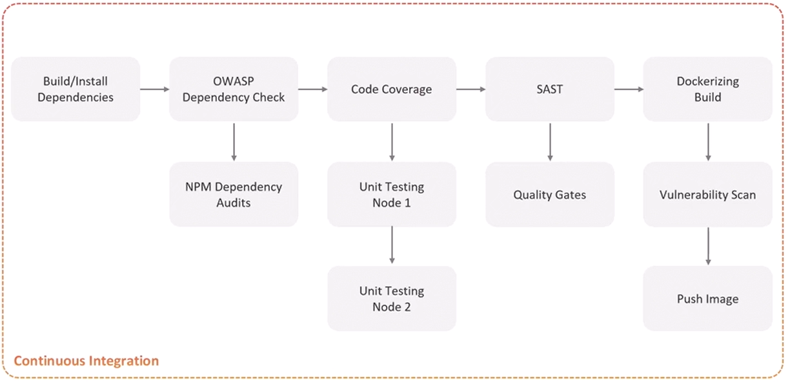
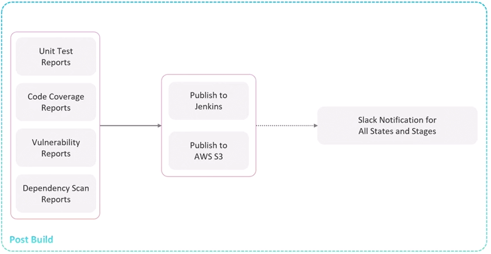

# Jenkins Pipeline Tutorial
In this tutorial, you will get a step by step guide to create Jenkins pipelines for different Java projects


1. [Pipeline Overview](#pipeline-overview)
2. [Pipeline Syntax](#pipeline-syntax)
3. [Continuos Integration](#continuos-integration)
    1. [Build and Push To Registry](#build-and-push-to-registry)
        1. [Github package Registry](#github-package-registry)
        2. [Nexus Registry](#nexus-registry)


## Continuos Integration

### Build and Push To Registry
#### Github package Registry
**Docker Images**
Prerequisites:
1. Docker Plugin, Docker Credentials Plugin, Docker Pipeline Plugin
2. Jenkins access to Docker environment

```groovy
pipeline {
    environment {
        DOCKER_IMAGE_NAME = "car-pooling-be:${BUILD_ID}"
        REGISTRY_URL = 'ghcr.io'
        REGISTRY_REPO = 'hjaijhoussem'
    }
    stages{

        stage('Login to registry'){
            steps {
                withCredentials([usernamePassword(credentialsId: 'perso-gh-registry', usernameVariable: 'GH_USERNAME', passwordVariable: 'GH_PASSWORD')]) {
                    sh "docker login ${REGISTRY_URL} -u ${GH_USERNAME} -p ${GH_PASSWORD}"
                } 
            }
        
        }
        stage('Build Docker Image') {
            steps {
                sh "docker build -t ${DOCKER_IMAGE_NAME} ."
            }
        }
        stage('Push Docker Image') {
            steps {
                sh """
                    docker tag ${DOCKER_IMAGE_NAME} ${REGISTRY_URL}/${REGISTRY_REPO}/${DOCKER_IMAGE_NAME}
                    docker push ${REGISTRY_URL}/${REGISTRY_REPO}/${DOCKER_IMAGE_NAME}
                """
            }
        }
    }
}
```

**Jar file**
Prerequisites:
1. maven installation in jenkins 
2. pom.xml github package url configuration:
```xml
<distributionManagement>
    <repository>
        <id>github</id>
        <name>GitHub Packages</name>
        <url>https://maven.pkg.github.com/hjaijhoussem/Car-pooling-backend</url>
    </repository>
</distributionManagement>
```
Syntax:
```groovy
pipeline { 
    agent any
    
    tools {
        maven 'maven-3.9.1'
    }
    
    environment {
        // JAR config
        JAR_FILE = 'target/car-pooling-be.jar'
        GITHUB_PKG_URL = "https://maven.pkg.github.com/hjaijhoussem/Car-pooling-backend"
    }

    stages {
        stage('Login to GitHub Packages') {
            steps {
                script {
                    withCredentials([usernamePassword(credentialsId: 'perso-gh-registry', 
                                                    usernameVariable: 'GH_USERNAME', 
                                                    passwordVariable: 'GH_PASSWORD')]) {
                        // Create settings.xml for Maven
                        writeFile file: 'settings.xml', text: """
                            <settings>
                                <servers>
                                    <server>
                                        <id>github</id>
                                        <username>${GH_USERNAME}</username>
                                        <password>${GH_PASSWORD}</password>
                                    </server>
                                </servers>
                            </settings>
                        """
                    }
                }
            }
        }

        stage('Publish JAR') {
            steps {
                sh """
                    mvn deploy:deploy-file \
                    -DgroupId=com.example \
                    -DartifactId=car-pooling-be \
                    -Dversion=${BUILD_ID} \
                    -Dpackaging=jar \
                    -Dfile=${JAR_FILE} \
                    -DrepositoryId=github \
                    -Durl=${GITHUB_PKG_URL} \
                    -s settings.xml
                """
            }
        }
    }
    
    post {
        always {
            sh 'rm -f settings.xml'
            sh 'docker logout ${REGISTRY_URL}'
        }
    }
}
```
#### Nexus Registry

## Post build

**Prerequisites:**
1. HTML Publisher and JUnit plugins
   - Install "HTML Publisher" and "JUnit" from Jenkins Plugin Manager
   - Navigate to: Manage Jenkins > Manage Plugins > Available > Search "HTML Publisher" and "JUnit"


**Syntax:**
```groovy
post{
    
    // Publish Dependency Check Reports
    junit allowEmptyResults: true, stdioRetention: '', testResults: 'dependency-check-report.xml'

    publishHTML([allowMissing: true, alwaysLinkToLastBuild: true, keepAll: true, reportDir: './', reportFiles: 'dependency-check-jenkins.html', reportName: 'Dependency Check HTML Report', reportTitles: '', useWrapperFileDirectly: true])

    // Publish Junit XML Report
    junit allowEmptyResults: true, stdioRetention: '', testResults: 'test-results.xml'

    // Publish Code Coverage Report
    publishHTML([allowMissing: true, alwaysLinkToLastBuild: true, keepAll: true, reportDir: './coverage/lcov-report', reportFiles: 'index.html', reportName: 'Code Coverage HTML Report', reportTitles: '', useWrapperFileDirectly: true])

    
}
```
**Note:** syntax From "Pipeline Syntax" ->  "Snippet Generator" -> `publishHTML: Publish HTML reports`
 


