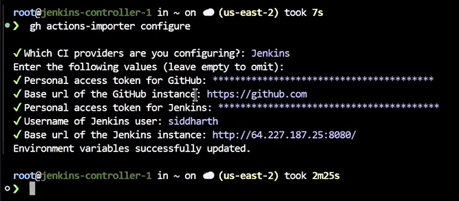
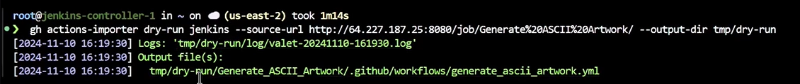

# Migrate from Jenkins to Github Actions

Official Documentations: 
- [Migrating from Jenkins to Github Actions](https://docs.github.com/en/actions/migrating-to-github-actions/manually-migrating-to-github-actions/migrating-from-jenkins-to-github-actions)
- [Automating Migration with Github Actions Importer](https://docs.github.com/en/actions/migrating-to-github-actions/using-github-actions-importer-to-automate-migrations/automating-migration-with-github-actions-importer)

## Pre-requisites
- Github CLI installed :
    - [Linux (Debian & RPM)](https://github.com/cli/cli/blob/trunk/docs/install_linux.md)
    - [Others](https://github.com/cli/cli?tab=readme-ov-file#installation)
- Docker is installed and running

## 1. Install and Configure Github Actions Importer
1. Install Github Actions Importer

    ```shell 
    gh extension install github/gh-actions-importer

    # Verify installation
    gh actions-importer -h
    ```
2. Configure Github Actions Importer

    It will ask to pass a:
    - Gitub Personal access token, Make sure that **Repo** and **workflow** options checked
    - Github Base URL: https://github.com
    - Personal Access token for jenkins:
        1. I Jenkins: Go to User > Configure > API Token 
        2. Click Add new token, give it a name(e.g. Github Importer), and save.
    - Username of the jenkins user
    - Base URL of the Jenkins instance
    ```
    gh actions-importer configure
    ```
    <p align="center">
    
    </p>
3. Run the GitHub Actions Importer `update` command
    ```
    gh actions-importer update
    ```
    The GitHub Actions Importer update CLI command to connect to GitHub Packages Container registry and ensure that the container image is updated to the latest version.
4. Perform a dry-run migration of a Jenkins pipeline
    ```
    gh actions-importer dry-run jenkins --source-url <jenkins-project-name> --output-dir tmp/dry-run
    ```
    `Jenkins project name`: the Full `Job URL` you want to convert.

    You can use the dry-run command to convert a Jenkins pipeline to an equivalent GitHub Actions workflow. A dry-run creates the output files in a specified directory, but does not open a pull request to migrate the pipeline.

    **Output**:
    <p align="center">
    
    </p>
5. Check The Github Actions pipeline generated

    The ouput file path contains the Generated Github Actions pipeline
    ```shell
    cat <full-path>
    ```
6. Run the migrate command
    
   After checking the generated pipeline, if everything is as it should be, run the github import migrate command

   ```
   gh actions-importer migrate jenkins --target-url https://github.com/:owner/:repo --output-dir tmp/migrate --source-url my-jenkins-project
   ``` 
   In the migrate command you have additional parameter the `target-url`which is the URL for your GitHub repository. So you need to **create a github repo first**. This command it will create a PR.
