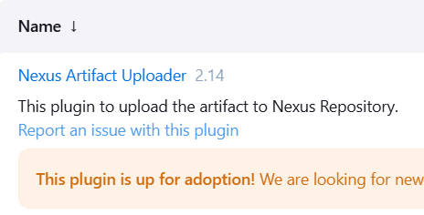

# Jenkins Pipeline Tutorial

In this tutorial, you will get a step by step guide to create Jenkins pipelines for different project types (Python, Node.js, Java) and for mobile and web apps across different branches.


1. [Pipeline Overview](#pipeline-overview)
2. [Pipeline Syntax](#pipeline-syntax)
3. [Continuos Integration](#continuos-integration)
    1. [Buil/Install dependencies](#builinstall-dependencies)
    2. [Dependency Check](#dependency-check)
    3. [Unit Testing](#unit-testing)
    4. [Code Coverage](#code-coverage)
5. [Continuos Deployment](#continuos-deployment)
6. [Continuos Delivery](#continuos-delivery)
7. [Post build](#post-build)

## Pipeline Overview 


## Pipeline Syntax
```groovy
pipeline{


    environment{
        // Instead of using the Username and password credentials, use the Secret text 
        DOCKER_USERNAME = credentials('docker_username') // Secret text
        DOCKER_PASSWORD = credentials('docker_password') // Secret text
    }

    options{
        disableResume()  // Prevents the pipeline from resuming after a Jenkins restart
        disableConcurrentBuilds abortPrevious: true // Abort running builds when a new build is triggered
    }
}
```

## Continuos Integration

### Buil/Install dependencies
#### Node.js Project
**Prerequisites:**
1. NodeJS Plugin
   - Install "NodeJS Plugin" from Jenkins Plugin Manager
   - Navigate to: Manage Jenkins > Manage Plugins > Available > Search "NodeJS"

2. NodeJS Tool Configuration
   - Navigate to: Manage Jenkins > Tools
   - Scroll to NodeJS installations section
   - Click "Add NodeJS"
   - Configure:
     * Name: `nodejs-16` (or your preferred name)
     * Version: Select required version
     * Save/Apply

Note: The name configured in the NodeJS tool installation will be referenced in your Jenkinsfile's `tools` section. Node.js will be installed automatically when the pipeline executes.

**Syntax:**

```groovy
pipeline {
    agent any
    tools {
        nodejs 'nodejs-16'
    }
    stages{
        stage('Install dependencies'){
            steps{
                sh 'npm install --no-audit'
            }
        }
    }
}
```
### Dependency Check
#### Node.js Project
**Prerequisites:**
1. OWASP Dependency-Check Plugin
   - Install "NodeJS Plugin" from Jenkins Plugin Manager
   - Navigate to: Manage Jenkins > Manage Plugins > Available > Search "OWASP Dependency-Check"

<p align="center">
    
</p>

2. Dependency-check Tool Configuration
   - Navigate to: Manage Jenkins > Tools
   - Scroll to Dependecy-Check installations section
   - Click "Add"
   - Configure:
     * Name: `owasp-10.0.3` (or your preferred name)
     * Mark "Install automatically"
     * Click "Add Installer"
     * Select "Install from github"
     * Version: Select required version
     * Save/Apply

**Syntax:**
```groovy
stage('Dependency Scanninig'){
    parallel{

        stage('NPM Dependency Audit'){
            steps{
                // Fail the build when a critical vunerability exist
                sh 'npm audit --audit-level=critical' 
            }
        }

        stage('OWASP Dependency Check'){
            steps{
                dependencyCheck additionalArguments: '''
                    --scan \'./\'  
                    --out \'./\' 
                    --format \'ALL\' 
                    --prettyPrint''', odcInstallation: 'owasp-10.0.3'

                // Fail the build if one of The vunerability threshold is excided, and generate a report
                dependencyCheckPublisher failedTotalCritical: 1, failedTotalHigh: 4, failedTotalLow: 90, failedTotalMedium: 8, pattern: 'dependency-check-report.xml', stopBuild: true
            }
        }
    }
}
```
OWASP arguments:
- `--scan`: code folder path
- `--out`: the folder where the output files will generated
- `--format`: Output format(XML, JSON...)
- `--prettyPrint`: print the output in the console log 
- `odcInstallation`: dependecy check tool name

You can find this syntax in the **pipeline syntax generator**, search for **dependencyCheck Invoke Dependency-Check** and **dependencyCheckPublisher: Publish Dependency-Check results** 

Note: The **OWASP Dependency Check** will take too much time (~28 minutes). This can be avoided if you provide a dependency database key.
### Unit Testing
#### Node.js Project
```groovy
stage('Unit Testing'){
    steps{
        sh 'npm test'// NPM test command need to be added in the package.json file
    }
}
```
- To generate The Test results reports(XML, HTML) You need to:
    1. Add `jest-html-reporter` and `jest-junit` to dependencies list in the package.json file
    2. Add reports config in jest.config.js file : 
    ```js
    reporters: [
        'default',
        ['./node_modules/jest-html-reporter', {
            'pageTitle': 'Jest Test Report',
            'outputPath': 'jest-test-report.html',
            'includeFailureMsg': false
        }],
        ['./node_modules/jest-junit', {
            'suiteName': 'jest tests',
            'outputDirectory': '.',
            'outputName': 'test-results.xml',
            'uniqueOutputName': 'false',
            'classNameTemplate': '{classname}-{title}',
            'titleTemplate': '{classname}-{title}',
            'ancestorSeparator': ' › ',
            'usePathForSuiteName': 'true'
        }]
    ]
    ```

### Code Coverage
```groovy
stage('Code Coverage'){
    steps{
        catchError(buildResult: 'SUCCESS', message: 'Coverage', stageResult: 'UNSTABLE') {
            sh 'npm run coverage'
        }
    }
}
```
- The `CatchError` block will prevent the pipeline from failing if the `sh 'npm run coverage'` command fails.
- A Folder named `coverage` will be created in the workspace and the coverage report will be saved in it.
<p align="center">
    
</p>

- The Coverage file report will be saved in the `lcov-report` folder under the name `index.html`.
## Continuos Deployment

## Continuos Delivery

## Post build

**Prerequisites:**
1. HTML Publisher and JUnit plugins
   - Install `HTML Publisher` and `JUnit` from Jenkins Plugin Manager
   - Navigate to: Manage Jenkins > Manage Plugins > Available > Search `HTML Publisher` and `JUnit`


**Syntax:**

```groovy
post{
    
    // Publish Dependency Check Reports
    junit allowEmptyResults: true, stdioRetention: '', testResults: 'dependency-check-report.xml'

    publishHTML([allowMissing: true, alwaysLinkToLastBuild: true, keepAll: true, reportDir: './', reportFiles: 'dependency-check-jenkins.html', reportName: 'Dependency Check HTML Report', reportTitles: '', useWrapperFileDirectly: true])

    // Publish Junit XML Report
    junit allowEmptyResults: true, stdioRetention: '', testResults: 'test-results.xml'

    // Publish Code Coverage Report
    publishHTML([allowMissing: true, alwaysLinkToLastBuild: true, keepAll: true, reportDir: './coverage/lcov-report', reportFiles: 'index.html', reportName: 'Code Coverage HTML Report', reportTitles: '', useWrapperFileDirectly: true])

    
}
```

**Note:** syntax From "Pipeline Syntax" ->  "Snippet Generator" -> `publishHTML: Publish HTML reports`
 


