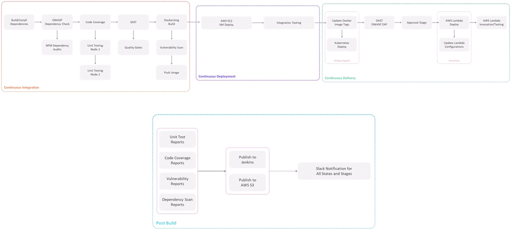
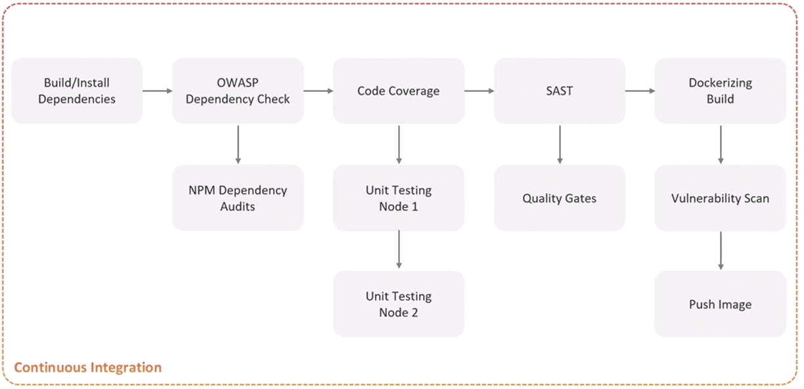
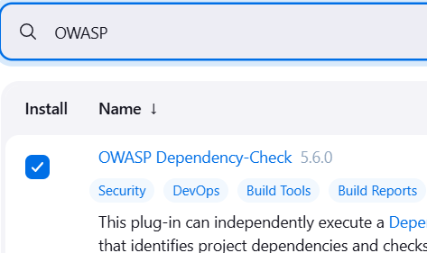
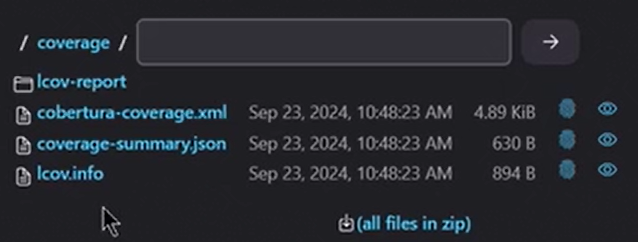
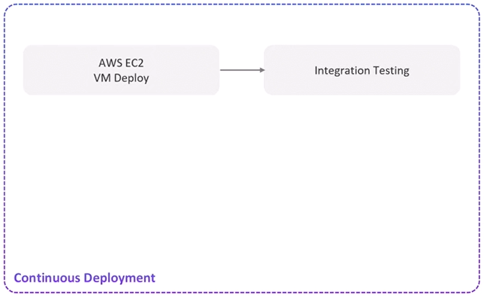
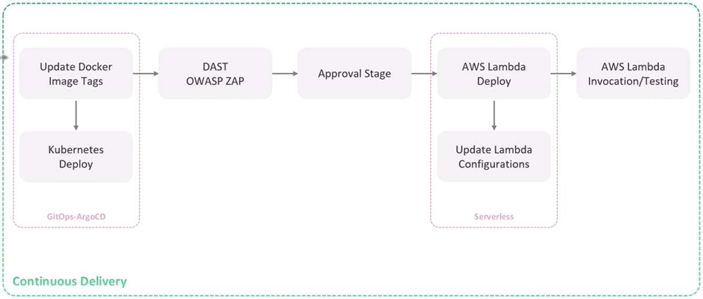
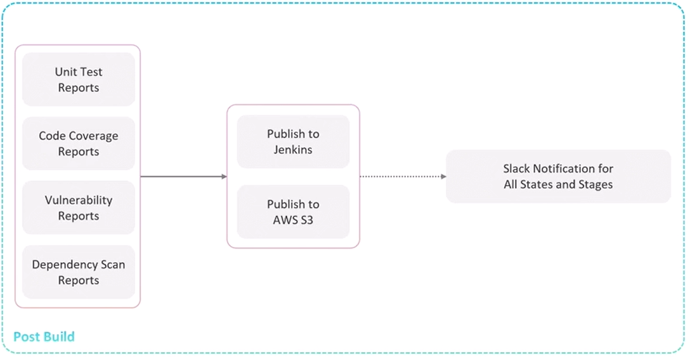
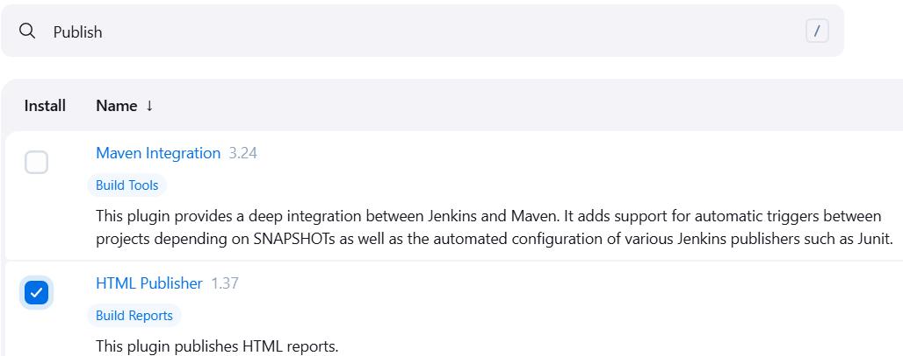
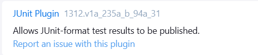

# Jenkins Pipeline Tutorial
In this tutorial, you will get a step by step guide to create Jenkins pipelines for react native mobile app project.


1. [Pipeline Overview](#pipeline-overview)
2. [Continuos Integration](#continuos-integration)
    1. [Buil/Install dependencies](#builinstall-dependencies)
    2. [Dependency Check](#dependency-check)
    3. [Unit Testing](#unit-testing)
    4. [Code Coverage](#code-coverage)
    5. [Build](#build)
    6. [Trivy vulnerability scanner](#trivy-vulnerability-scanner)
    7. [Push To Registry](#push-to-registry)
3. [Continuos Deployment](#continuos-deployment)
    1. [Integration Test](#integration-test)
4. [Continuos Delivery](#continuos-delivery)
5. [Post build](#post-build)
6. [Best Practices](#best-practices)

## Pipeline Overview 



## Continuos Integration

### Buil/Install dependencies
**Prerequisites:**
1. NodeJS Plugin
   - Install "NodeJS Plugin" from Jenkins Plugin Manager
   - Navigate to: Manage Jenkins > Manage Plugins > Available > Search "NodeJS"

2. NodeJS Tool Configuration
   - Navigate to: Manage Jenkins > Tools
   - Scroll to NodeJS installations section
   - Click "Add NodeJS"
   - Configure:
     * Name: `nodejs-16` (or your preferred name)
     * Version: Select required version
     * Save/Apply

Note: The name configured in the NodeJS tool installation will be referenced in your Jenkinsfile's `tools` section. Node.js will be installed automatically when the pipeline executes.

**Syntax:**

```groovy
pipeline {
    agent any
    tools {
        nodejs 'nodejs-16'
    }
    stages{
        stage('Install dependencies'){
            steps{
                sh 'npm install --no-audit'
            }
        }
    }
}
```
### Dependency Check
**Prerequisites:**
OWASP Dependency-Check Plugin

<p align="center">
    
</p>

2. Dependency-check Tool Configuration
   - Navigate to: Manage Jenkins > Tools
   - Scroll to Dependecy-Check installations section
   - Click "Add"
   - Configure:
     * Name: `owasp-10.0.3` (or your preferred name)
     * Mark "Install automatically"
     * Click "Add Installer"
     * Select "Install from github"
     * Version: Select required version
     * Save/Apply

**Syntax:**
```groovy
stage('Dependency Scanninig'){
    parallel{

        stage('NPM Dependency Audit'){
            steps{
                // Fail the build when a critical vunerability exist
                sh 'npm audit --audit-level=critical' 
            }
        }

        stage('OWASP Dependency Check'){
            steps{
                dependencyCheck additionalArguments: '''
                    --scan \'./\'  
                    --out \'./\' 
                    --format \'ALL\' 
                    --prettyPrint''', odcInstallation: 'owasp-10.0.3'

                // Fail the build if one of The vunerability threshold is excided, and generate a report
                dependencyCheckPublisher failedTotalCritical: 1, failedTotalHigh: 4, failedTotalLow: 90, failedTotalMedium: 8, pattern: 'dependency-check-report.xml', stopBuild: true
            }
        }
    }
}
```
OWASP arguments:
- `--scan`: code folder path
- `--out`: the folder where the output files will generated
- `--format`: Output format(XML, JSON...)
- `--prettyPrint`: print the output in the console log 
- `odcInstallation`: dependecy check tool name

You can find this syntax in the **pipeline syntax generator**, search for **dependencyCheck Invoke Dependency-Check** and **dependencyCheckPublisher: Publish Dependency-Check results** 

Note: The **OWASP Dependency Check** will take too much time (~28 minutes). This can be avoided if you provide a dependency database key.
### Unit Testing
```groovy
stage('Unit Testing'){
    steps{
        sh 'npm test'// NPM test command need to be added in the package.json file
    }
}
```
### Code Coverage
```groovy
stage('Code Coverage'){
    steps{
        catchError(buildResult: 'SUCCESS', message: 'Coverage', stageResult: 'UNSTABLE') {
            sh 'npm run coverage'
        }
    }
}
```
- The `CatchError` block will prevent the pipeline from failing if the `sh 'npm run coverage'` command fails.
- A Folder named `coverage` will be created in the workspace and the coverage report will be saved in it.
<p align="center">
    
</p>

- The Coverage file report will be saved in the `lcov-report` folder under the name `index.html`.

### Build
#### Github package Registry
**Docker Images**

Prerequisites:
1. Docker Plugin, Docker Credentials Plugin, Docker Pipeline Plugin
2. Jenkins access to Docker environment

```groovy
pipeline {
    environment {
        DOCKER_IMAGE_NAME = "car-pooling-be:${BUILD_ID}"
        REGISTRY_URL = 'ghcr.io'
        REGISTRY_REPO = 'hjaijhoussem'
    }
    stages{

        stage('Login to registry'){
            steps {
                withCredentials([usernamePassword(credentialsId: 'perso-gh-registry', usernameVariable: 'GH_USERNAME', passwordVariable: 'GH_PASSWORD')]) {
                    sh "docker login ${REGISTRY_URL} -u ${GH_USERNAME} -p ${GH_PASSWORD}"
                } 
            }
        
        }
        stage('Build Docker Image') {
            steps {
                sh "docker build -t ${DOCKER_IMAGE_NAME} ."
            }
        }
    }
}
```
### Trivy vulnerability scanner
```groovy
stage('Trivy vulnerability scanner'){
    steps{
        // Scan and report LOW, MEDIUM and HIGH severity without failing the build
        sh '''
            trivy image ${REGISTRY_URL}/${REGISTRY_REPO}/${DOCKER_IMAGE_NAME} \
            --severity LOW,MEDIUM,HIGH \
            --exit-code 0 \
            --quiet \ # Suppress output to the console
            --format json -o trivy-image-MEDUIM-results.json
        '''
        // Scan and report CRITICAL severity and fail the build if a critical vunerability exist
        sh '''
            trivy image ${REGISTRY_URL}/${REGISTRY_REPO}/${DOCKER_IMAGE_NAME} \
            --severity CRITICAL \
            --exit-code 1 \
            --quiet \ # Suppress output to the console
            --format json -o trivy-image-CRITICAL-results.json
        '''
    }
    post{
        always {
            // Convert Trivy JSON reports to JUnit XML and HTML
            sh '''
                # Convert LOW,MEDIUM results to JUnit XML and HTML

                trivy convert --format template --template "@/usr/local/share/trivy/templates/junit.tpl" \
                --input trivy-image-MEDUIM-results.json --output trivy-junit-MEDUIM-report.xml
                
                trivy convert --format template --template "@/usr/local/share/trivy/templates/html.tpl" \
                --input trivy-image-MEDUIM-results.json --output trivy-MEDUIM-report.html
                
                # Convert HIGH,CRITICAL results to XML and HTML

                trivy convert --format template --template "@/usr/local/share/trivy/templates/junit.tpl" \
                --input trivy-image-CRITICAL-results.json --output trivy-junit-CRITICAL-report.xml

                trivy convert --format template --template "@/usr/local/share/trivy/templates/html.tpl" \
                --input trivy-image-CRITICAL-results.json --output trivy-CRITICAL-report.html
            '''
        }
    }
}
```
### Push To Registry
#### Github package Registry
```groovy
        stage('Push Docker Image') {
            steps {
                sh """
                    docker tag ${DOCKER_IMAGE_NAME} ${REGISTRY_URL}/${REGISTRY_REPO}/${DOCKER_IMAGE_NAME}
                    docker push ${REGISTRY_URL}/${REGISTRY_REPO}/${DOCKER_IMAGE_NAME}
                """
            }
        }
```
## Continuos Deployment

### Integration Test
```groovy
    stage('Integration Test'){
        environment{
            DOCKER_CONTAINER_NAME = 'car-pooling-be'
        }
        steps{
            sh '''
                if docker ps -a | grep ${DOCKER_CONTAINER_NAME}; then
                    echo "Container ${DOCKER_CONTAINER_NAME} found, Stopping..."
                    docker stop ${DOCKER_CONTAINER_NAME}
                    docker rm ${DOCKER_CONTAINER_NAME}
                fi
                echo "Starting ${DOCKER_CONTAINER_NAME}..."
                docker run -d --name ${DOCKER_CONTAINER_NAME} ${REGISTRY_URL}/${REGISTRY_REPO}/${DOCKER_IMAGE_NAME}
            '''
        }
    }
```
## Continuos Delivery

## Post build

**Prerequisites:**
1. HTML Publisher and JUnit plugins
   - Install "HTML Publisher" and "JUnit" from Jenkins Plugin Manager
   - Navigate to: Manage Jenkins > Manage Plugins > Available > Search "HTML Publisher" and "JUnit"



**Syntax:**
```groovy
post{
    
    // Publish Dependency Check Reports
    junit allowEmptyResults: true, stdioRetention: '', testResults: 'dependency-check-report.xml'

    publishHTML([allowMissing: true, alwaysLinkToLastBuild: true, keepAll: true, reportDir: './', reportFiles: 'dependency-check-jenkins.html', reportName: 'Dependency Check HTML Report', reportTitles: '', useWrapperFileDirectly: true])

    // Publish Junit XML Report
    junit allowEmptyResults: true, stdioRetention: '', testResults: 'test-results.xml'

    // Publish Code Coverage Report
    publishHTML([allowMissing: true, alwaysLinkToLastBuild: true, keepAll: true, reportDir: './coverage/lcov-report', reportFiles: 'index.html', reportName: 'Code Coverage HTML Report', reportTitles: '', useWrapperFileDirectly: true])

    // Publish Trivy Reports
    publishHTML([allowMissing: true, alwaysLinkToLastBuild: true, keepAll: true, reportDir: './', reportFiles: 'trivy-MEDUIM-report.html', reportName: 'Trivy MEDUIM Report', reportTitles: '', useWrapperFileDirectly: true])

    publishHTML([allowMissing: true, alwaysLinkToLastBuild: true, keepAll: true, reportDir: './', reportFiles: 'trivy-CRITICAL-report.html', reportName: 'Trivy CRITICAL Report', reportTitles: '', useWrapperFileDirectly: true])

    junit allowEmptyResults: true, stdioRetention: '', testResults: 'trivy-junit-MEDUIM-report.xml'

    junit allowEmptyResults: true, stdioRetention: '', testResults: 'trivy-junit-CRITICAL-report.xml'

    
}
```

## Best Practices
```groovy
pipeline{


    environment{
        // Instead of using the Username and password credentials, use the Secret text 
        DOCKER_USERNAME = credentials('docker_username') // Secret text
        DOCKER_PASSWORD = credentials('docker_password') // Secret text
    }

    options{
        disableResume()  // Prevents the pipeline from resuming after a Jenkins restart
        disableConcurrentBuilds abortPrevious: true // Abort running builds when a new build is triggered
    }
}
```


