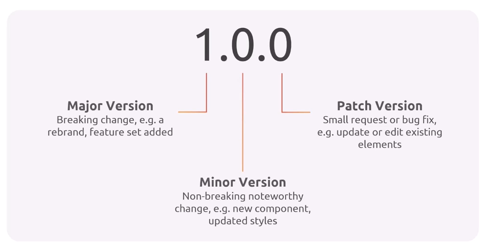
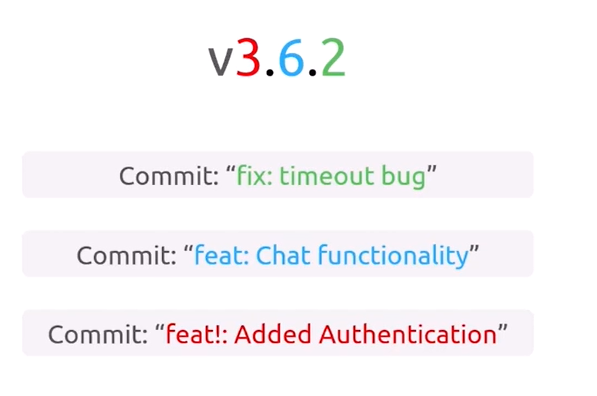

# Semantic Versioning for Releases

This document outlines our approach to semantic versioning for project releases using Jenkins and GitHub.

## Overview

Semantic Versioning (SemVer) provides a consistent way to version software releases, making it clear what kind of changes are included in each release. This document describes how we implement SemVer using Jenkins pipelines and GitHub releases/tags.

## Semantic Versioning Specification

We follow the [Semantic Versioning 2.0.0](https://semver.org/) specification:


  <p align="center">
      
  </p>

```
MAJOR.MINOR.PATCH[-PRERELEASE][+BUILD]
```

- **MAJOR**: Incremented for incompatible API changes
- **MINOR**: Incremented for backward-compatible functionality additions
- **PATCH**: Incremented for backward-compatible bug fixes
- **PRERELEASE**: Optional identifier for pre-release versions (e.g., alpha, beta)
- **BUILD**: Optional build metadata

## Implementation with Jenkins and GitHub

<p align="center">
    
</p>


- By default jenkins does not fetch github tags, so make sure to enable it in the job configuration:
    1. In job configuration, search for **Additional Behaviours**, and click **Add**.
    2. Choose **Advanced clone behaviours**
    3. Check **Fetch tags**, click save.
### Prerequisites

- Jenkins server with appropriate plugins:
  - [Git Plugin](https://plugins.jenkins.io/git/)
  - [GitHub Integration Plugin](https://plugins.jenkins.io/github-integration/)
  - [Pipeline Plugin](https://plugins.jenkins.io/workflow-aggregator/)
- GitHub repository with appropriate access rights
- Jenkins credentials configured for GitHub access

### Workflow

1. **Commit Message Convention**

   We use conventional commits to determine version increments automatically:

   ```
   <type>[optional scope]: <description>

   [optional body]

   [optional footer(s)]
   ```

   Types that trigger version changes:
   - `fix:` - Patch version increment (bug fixes)
   - `feat:` - Minor version increment (new features)
   - `BREAKING CHANGE:` or `feat!:` - Major version increment

2. **Jenkins Pipeline for Version Management**

   Here's an example Jenkinsfile snippet that handles semantic versioning:

   ```groovy
   pipeline {
       agent any
       
       environment {
           GIT_CREDENTIALS_ID = 'github-credentials'
           GITHUB_TOKEN = credentials('github-token')
       }
       
       stages {
           stage('Determine Version') {
               steps {
                   script {
                       // Get the latest tag
                       def latestTag = sh(script: "git describe --tags --abbrev=0 || echo 'v0.0.0'", returnStdout: true).trim()
                       
                       // Parse the version
                       def (major, minor, patch) = latestTag.replace('v', '').tokenize('.')
                       
                       // Analyze commit messages since last tag
                       def commitMessages = sh(script: "git log ${latestTag}..HEAD --pretty=format:'%s'", returnStdout: true)
                       
                       // Determine version increment
                       def isBreaking = commitMessages.contains("BREAKING CHANGE:") || commitMessages.contains("feat!:")
                       def hasFeat = commitMessages.contains("feat:")
                       def hasFix = commitMessages.contains("fix:")
                       
                       if (isBreaking) {
                           major = major.toInteger() + 1
                           minor = 0
                           patch = 0
                       } else if (hasFeat) {
                           minor = minor.toInteger() + 1
                           patch = 0
                       } else if (hasFix) {
                           patch = patch.toInteger() + 1
                       } else {
                           // No version change if no relevant commits
                           echo "No version change required"
                       }
                       
                       // Set the new version
                       env.NEW_VERSION = "v${major}.${minor}.${patch}"
                       echo "New version: ${env.NEW_VERSION}"
                   }
               }
           }
           
           stage('Build and Test') {
               steps {
                   // Your build and test steps here
                   echo "Building and testing version ${env.NEW_VERSION}"
               }
           }
           
           stage('Create GitHub Release') {
               when {
                   branch 'main'
               }
               steps {
                   script {
                       // Tag the commit
                       sh """
                           git config user.email "jenkins@example.com"
                           git config user.name "Jenkins"
                           git tag -a ${env.NEW_VERSION} -m "Release ${env.NEW_VERSION}"
                           git push https://${GITHUB_TOKEN}@github.com/organization/repo.git ${env.NEW_VERSION}
                       """
                       
                       // Generate release notes
                       def releaseNotes = sh(script: "git log ${latestTag}..HEAD --pretty=format:'- %s'", returnStdout: true)
                       
                       // Create GitHub release
                       sh """
                           curl -X POST \
                               -H "Authorization: token ${GITHUB_TOKEN}" \
                               -H "Accept: application/vnd.github.v3+json" \
                               https://api.github.com/repos/organization/repo/releases \
                               -d '{
                                   "tag_name": "${env.NEW_VERSION}",
                                   "name": "Release ${env.NEW_VERSION}",
                                   "body": "${releaseNotes.replaceAll('"', '\\\\"')}",
                                   "draft": false,
                                   "prerelease": false
                               }'
                       """
                   }
               }
           }
       }
   }
   ```

## Release Types and Environments

We use the following environments and release types:

1. **Development (dev)**
   - Automatically versioned with build metadata
   - Format: `vX.Y.Z-dev+YYYYMMDD.BUILDNUM`

2. **Testing/Staging (beta)**
   - Pre-release versions for testing
   - Format: `vX.Y.Z-beta.N`

3. **Production (release)**
   - Official releases
   - Format: `vX.Y.Z`

## Using Jenkins Shared Library

For more maintainable code, you can extract the versioning logic into a Jenkins shared library:

```groovy
// vars/determineVersion.groovy
def call() {
    // Get the latest tag
    def latestTag = sh(script: "git describe --tags --abbrev=0 || echo 'v0.0.0'", returnStdout: true).trim()
    
    // Parse the version
    def (major, minor, patch) = latestTag.replace('v', '').tokenize('.')
    
    // Analyze commit messages since last tag
    def commitMessages = sh(script: "git log ${latestTag}..HEAD --pretty=format:'%s'", returnStdout: true)
    
    // Determine version increment
    def isBreaking = commitMessages.contains("BREAKING CHANGE:") || commitMessages.contains("feat!:")
    def hasFeat = commitMessages.contains("feat:")
    def hasFix = commitMessages.contains("fix:")
    
    if (isBreaking) {
        major = major.toInteger() + 1
        minor = 0
        patch = 0
    } else if (hasFeat) {
        minor = minor.toInteger() + 1
        patch = 0
    } else if (hasFix) {
        patch = patch.toInteger() + 1
    }
    
    return "v${major}.${minor}.${patch}"
}
```

## Example Usage in Projects

In your Jenkinsfile for projects:

```groovy
pipeline {
    agent any
    
    stages {
        stage('Version') {
            steps {
                script {
                    env.VERSION = determineVersion()
                    echo "Building version: ${env.VERSION}"
                }
            }
        }
        
        // Rest of your pipeline
    }
}
```

## Best Practices

1. **Never modify a released version**
   - Once a version is released, it must not be modified
   - Any changes require a new version

2. **Pre-release and development versions**
   - Use pre-release versions for testing
   - Always test releases in a staging environment before production

3. **Release notes**
   - Always include detailed release notes with each version
   - Categorize changes (Features, Bug Fixes, Breaking Changes)

4. **Automated workflow**
   - Automate as much of the versioning process as possible
   - Use Jenkins to enforce version policies

## Examples

### Minor Version Release

A new feature was added, triggering a minor version increment:

```
Previous version: v1.2.3
Commit: feat: add user profile page
New version: v1.3.0
```

### Patch Version Release

A bug fix was committed, triggering a patch version increment:

```
Previous version: v1.3.0
Commit: fix: correct login error message
New version: v1.3.1
```

### Major Version Release

A breaking change was made, triggering a major version increment:

```
Previous version: v1.3.1
Commit: feat!: redesign API endpoints
New version: v2.0.0
```
