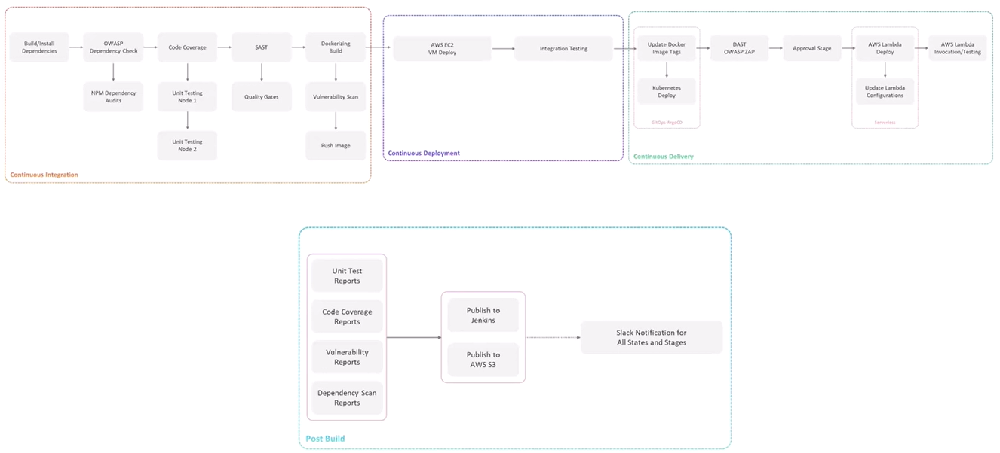
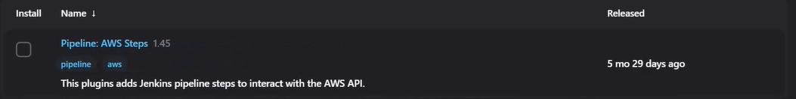
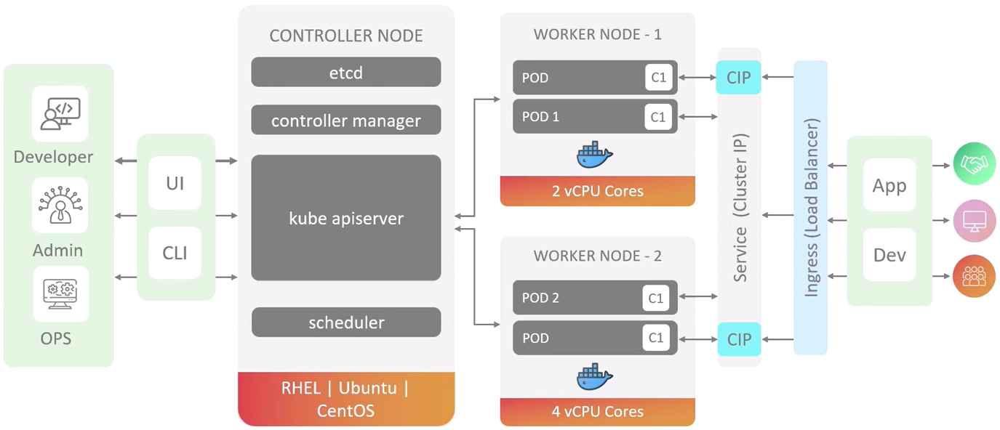
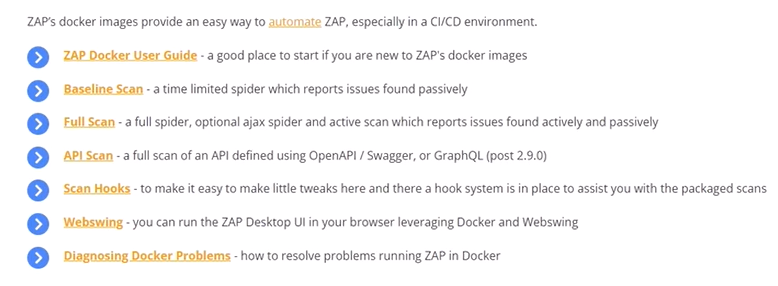

# React Js Workflow 

1. [Workfow stages overview](#workfows-stages-overview)
2. [kubernetes and GitOPS](#kubernetes-and-gitops)


## Workfow stages overview
**Note:** Usually A pipeline does not implement all this practices, but   
  <p align="center">
      
  </p>

### Continuos Integration
1. Build/install Dependencies
2. OWASP Dependency Check  and NPM Dependency Audits
3. Unit tests
4. Code Coverage
5. SAST (sonarqube)
6. Quality Gates (sonarqube)
7. Building docker image
8. Vulnerability scan (Trivy)
9. Push image to registry
### Continuos Deployment
1. AWS EC2 VM Deploy ( [AWS EC2 VM Deploy](#aws-ec2-vm-deploy) )
2. Integration Testing ( [Integration Testing](#integration-testing) )
3. Raise PR to main branch
### Contiuos Delivery
1. Update Docker image Tags (Triggered by the PR raised on main)
2. Deploy to Kubernetes (GitOps - ArgoCD) (Triggered by the PR raised on main)
3. Dynamic Application Security Testion DAST (OWASP ZAP) (Triggered by the PR raised on main), If passed, Merge The PR to main
4. Approval Stage
5. AWS Lambda Deploy, Update Lambda Configurations ( [AWS Lambda Deploy, Update Lambda Configurations](#aws-lambda-deploy-update-lambda-configurations) ) 
6. AWS Lambda Invocation/Testing ( [AWS Lambda Invocation/Testing](#aws-lambda-invocationtesting) )
### Post Build 
**Archiving Reports:**
- Unit Test Reports
- Coverage Reports
- Vulnerability Reports
- Dependency Scan Reports

**Publishing Reports:**
- Publish to Jenkins
- Publish to AWS S3

**Slack Notifications for All States and Stages**
## AWS EC2 VM Deploy 

This section explains how to deploy your React application to an AWS EC2 instance using Jenkins pipeline.

### Prerequisites

- **AWS Steps Plugin**: Install this Jenkins plugin to interact with AWS services.
  <p align="center">
    
  </p>

### Configuration Steps

#### 1. Setup AWS Credentials

1. Navigate to **Manage Jenkins > Credentials > Add Credentials**
2. Select **AWS Credentials** and configure:
   - **Scope**: Global
   - **ID**: `aws-s3-ec2-lambda` (or your preferred ID)
   - **Description**: `AWS credentials for EC2 deployment`
   - **Access Key ID**: Your AWS access key
   - **Secret Access Key**: Your AWS secret key
3. Click **Create**

A success message will appear if credentials are valid: "These credentials are valid and have access to X availability zones"

#### 2. Configure SSH Connection

1. Install the **SSH Agent** plugin in Jenkins
2. Navigate to **Manage Jenkins > Credentials > Add Credentials**
3. Select **SSH Username with private key** and configure:
   - **Scope**: Global
   - **ID**: `aws-dev-deploy-ec2-instance` (or your preferred ID)
   - **Description**: `SSH connection for EC2 deployment`
   - **Username**: `ubuntu` (or your EC2 instance username)
   - **Private key**: Select **Enter directly** and paste your SSH private key
   - **Passphrase**: Enter if your key has one, otherwise leave blank
4. Click **Create**

### Pipeline Stage

Add this stage to your Jenkinsfile to deploy your React application to EC2:

```groovy
stage('Deploy - EC2 instance') {
    steps {
        sshagent(['aws-dev-deploy-ec2-instance']) {
            sh '''
                ssh -o StrictHostKeyChecking=no ubuntu@3.140.244.188 "
                    # Check if container exists and remove if found
                    if sudo docker ps -a | grep -q "solar-system"; then
                        echo "Container found. Stopping and removing..."
                        sudo docker stop "solar-system" && sudo docker rm "solar-system"
                    fi
                    
                    # Deploy application using Docker
                    sudo docker run --name solar-system \
                        -e MONGO_URI=$MONGO_URI \
                        -e MONGO_USERNAME=$MONGO_USERNAME \
                        -e MONGO_PASSWORD=$MONGO_PASSWORD \
                        -p 3000:3000 -d hjaiej/solar-system:$GIT_COMMIT
                "
            '''
        }
    }
}
```

## Integration Testing

After deploying your application to EC2, it's important to verify it works correctly by running integration tests.

### Test Script

Create a shell script named `integration-testing-ec2.sh` with the following content:

```shell
#!/bin/bash

echo "Starting integration tests for EC2 deployment..."

# Verify AWS CLI is installed
aws --version

# Get EC2 instance details
DATA=$(aws ec2 describe-instances)
echo "EC2 instance data retrieved"

# Find our deployment instance by tag
URL=$(aws ec2 describe-instances | jq -r '.Reservations[].Instances[] | select(.Tags[].Value == "dev-deploy") | .PublicDnsName')
echo "Target EC2 instance: $URL"

if [[ -n "$URL" ]]; then
    # Test 1: Health check endpoint
    http_code=$(curl -s -o /dev/null -w "%{http_code}" "http://$URL:3000/live")
    echo "Health check response code: $http_code"
    
    # Test 2: API endpoint test
    planet_data=$(curl -XPOST "http://$URL:3000/planet" -H "Content-Type: application/json" -d '{"id": "3"}')
    echo "Planet API response: $planet_data"
    
    # Extract planet name from response
    planet_name=$(echo $planet_data | jq .name -r)
    echo "Retrieved planet name: $planet_name"
    
    # Verify test results
    if [[ "$http_code" -eq 200 && "$planet_name" == "Earth" ]]; then
        echo "✅ All integration tests PASSED"
    else
        echo "❌ One or more tests FAILED"
        exit 1
    fi
else
    echo "❌ ERROR: Could not retrieve EC2 instance URL"
    exit 1
fi
```

> **Note**: This script requires the AWS CLI and jq to be installed in your Jenkins environment.

### Pipeline Stage

Add this stage to your Jenkinsfile to run the integration tests:

```groovy
stage('Integration Testing - AWS EC2') {
    when {
        branch 'feature/*'  // Only run on feature branches
    }
    steps {
        // Display current branch for debugging
        sh 'printenv | grep -i branch'
        
        // Run integration tests with AWS credentials
        withAWS(credentials: 'aws-s3-ec2-instance-creds', region: 'us-east-2') {
            sh 'bash integration-testing-ec2.sh'
        }
    }
}
```

This stage will run automatically for feature branches, ensuring your application works correctly on the EC2 instance before proceeding with further pipeline stages.

## kubernetes and GitOPS
### K8s basics 

Kubernetes (K8s) is a container orchestration platform that automates the deployment, scaling, and management of containerized applications.

<p align="center">
    
</p>

**Key Components:**
- **Pods**: Smallest deployable units that contain one or more containers
- **Deployments**: Manage the deployment and scaling of pods
- **Services**: Enable network access to pod sets
- **ConfigMaps/Secrets**: Store configuration data and sensitive information

### Argo-CD concetops and termonologies

Argo CD is a declarative GitOps continuous delivery tool for Kubernetes.

<p align="center">
    
</p>

### CI-CD with GitOps

GitOps uses Git as the single source of truth for infrastructure and application definitions.

<p align="center">
    
</p>

**Workflow:**
1. Developers push code changes to application repository
2. CI pipeline builds, tests, and pushes Docker images
3. Image tag/version updated in Kubernetes manifest repository
4. Argo CD detects changes and automatically syncs the cluster state

### Deploy Argo CD
```bash
# Install Argo CD in your Kubernetes cluster
kubectl create namespace argocd
kubectl apply -n argocd -f https://raw.githubusercontent.com/argoproj/argo-cd/stable/manifests/install.yaml

# Access Argo CD UI
kubectl port-forward svc/argocd-server -n argocd 8080:443

# Login using admin credentials
argocd login localhost:8080
```

For more information, visit the [Argo CD documentation](https://argo-cd.readthedocs.io/).

### Gitops workflow setup

####  Creating Applications in Argo CD

Before you begin:
- Ensure your Kubernetes manifests are stored in a Git repository
- Have access to your Argo CD instance

**Steps to Create an Application:**

1. **Prepare Your Repository**
   - Organize your Kubernetes manifests in a dedicated directory (e.g., `./kubernetes`)
   - Commit and push your manifests to your Git repository

2. **Access the Argo CD UI**
   - Navigate to your Argo CD instance URL
   - Log in with your credentials

3. **Create a New Application**
   - Click the **+ NEW APP** button in the upper left corner
   - Configure your application with the following settings:

   | Section | Field | Description | Example |
   |---------|-------|-------------|---------|
   | **General** | Name | Unique name for your application | `react-app` |
   | | Project | Project to organize applications | `default` |
   | | Sync Policy | How changes are applied | `Automatic` or `Manual` |
   | | Sync Options | Additional sync behaviors | ✓ `AUTO-CREATE NAMESPACE` |
   | **Source** | Repository URL | Git repository containing manifests | `https://github.com/your-org/your-repo.git` |
   | | Revision | Git branch or tag | `main` or `HEAD` |
   | | Path | Directory containing manifests | `./kubernetes` |
   | **Destination** | Cluster URL | Target Kubernetes cluster | `https://kubernetes.default.svc` |
   | | Namespace | Target namespace | `react-app` |

4. **Review and Create**
   - Verify all settings are correct
   - Click **CREATE** to finish

5. **Sync Your Application**
   - If using manual sync policy, click the **SYNC** button to deploy
   - Argo CD will apply your Kubernetes manifests to the cluster

#### Verifying Deployment

After creating your application:
1. Monitor the sync status on the Applications dashboard
2. Green status indicators show successful synchronization
3. Explore the application topology to view all deployed resources

For troubleshooting sync issues, check the Argo CD logs:
```bash
kubectl logs -n argocd -l app.kubernetes.io/name=argocd-server
```
#### Stages 

Make sure that Trigger on Pull Request is checked in the Git Repo.

**Update kubernetes Docker Image Tag:**
```groovy
stage('K8s Update Image Tag'){
    when{
        branch 'PR*'
    }
    environment {
        REPO_ACCESS_TOKEN = credentails('repo-access-token')
    }
    steps{
        sh 'git clone -b main <git-repo-url>'
        dir('<repo-name>/kubernetes'){
            sh '''
                #### Replace Docker Tag ####
                git checkout main
                git checkout -b feature-$BUILD_ID
                sed -i "s#frontend.#frontend/solr-system:$GIT_COMMIT#g" deployment.yml
                cat deployment.yml

                #### Commit and Push to feature branch ####
                git config --global user.email "<user-email>"
                git remote set-url origin http://$REPO_ACCESS_TOKEN@<repo-url-without-http>
                git add .
                git commit -am "Update docker image"
                git push -u origin feature-$BUILD_ID
            '''
        }
        post {
            always{
                script{
                    if (fileExists('<repo-name>')){
                        sh 'rm -rf <repo-name>'
                    }
                }
            }
        }
    }
}
```
**Raise PR to kubernetes Repo:**
```groovy
stage('k8s - Raise PR'){
    when{
        branch 'PR*'
    }
    environment {
        REPO_ACCESS_TOKEN = credentails('repo-access-token')
    }
    steps{
        sh """
            curl -X POST \
                '<repo-url>'
                -H 'accept: application/json' \
                -H 'Authorization: token ${REPO_ACCESS_TOKEN}'
                -H 'Content-Type: application/json'
                -d '{
                    "assignee": "<git-username>",
                    "assignees": [
                        "<git-username>"
                    ],
                    "base":"main",
                    "body": "Updated image in deployment manifest",
                    "head": "feature-${BUILD_ID}",
                    "title": "Updated Docker Image"
                }'
        """
    }
}
```
The endpoint in *k8s - raise PR* stage may differ from Git Host Repo to another, so make sure to check the documentation.

**DAST:**

The DAST checks for attaquest like Cross site scripting, SQL Injection..., for that there is commercial and open-source projects, we will use the Open source **Zed Attack Proxy (ZAP)**, this type of vunerability testing it requires the application to be runnig. 

ZAP can be used in various ways, in this guide we will use the Docker approach, For the Docker approach there are multiple kind of scan,
<p align="center">
    
</p>

 For application that have frontend and backend it is recommended to use the **Full Scan**, but in this guide we will use the **API Scan**, this kind uses the *openapi(swagger), soap, or Graphql specification*

 ```groovy

 stage('APP Deployed?'){
    when{
        branch 'PR*'
    }
    steps{
        timeout(time: 1, unit: 'DAYS') {
            input message: 'Is the PR Merged and ArgoCD Synced?' ok: 'Yes! PR is Merged an ArgoCD Application is Synced'
        }
    }
 }

 stage('DAST - OWASP ZAP'){
    when{
        branch 'PR*'
    }
    steps{
        sh """
            chmod 777 ${pwd}
            docker run -v ${pwd}:/zap/wrk/:rw ghcr.io/zaproxy/zaproxy zap-api-scan.py \
            -t <backend-url>/api-docs/ \
            -f openapi \
            -r zap_report.html \
            -w zap_report.md \
            -j zap_json_report.json \
            -x zap_xml_report.xml
        """
    }
 }
 ```
 **Note**: the */api-docs/* its a jsob documentation not the UI documentation

## AWS Lambda Deploy, Update Lambda Configurations

This section explains how to deploy your React application to AWS Lambda for serverless hosting.

### Overview

The Lambda deployment process:
1. Modifies your application code for serverless execution
2. Packages the application as a ZIP file
3. Uploads the package to S3
4. Updates Lambda configuration with environment variables
5. Updates the Lambda function code with the new package

### Pipeline Stage

Add this stage to your Jenkinsfile to deploy your React application to AWS Lambda:

```groovy
stage('Lambda - S3 Upload & Deploy') {
    when {
        branch 'main'  // Only execute on main branch
    }
    steps {
        withAWS(credentials: 'aws-s3-ec2-lambda-creds', region: 'us-east-2') {
            // Step 1: Modify code for serverless execution
            sh '''
                # View original code structure
                tail -5 app.js
                
                # Comment out server listening code (not needed in Lambda)
                sed -i "/^app\\.listen(3000/ s/^/\\/\\//)" app.js
                
                # Enable Lambda handler exports
                sed -i "s|^//module.exports = app;/\\/\\/module.exports = app;/g" app.js
                sed -i "s|^//module.exports.handler|module.exports.handler|" app.js
                
                # Verify changes
                tail -5 app.js
            '''
            
            // Step 2: Create deployment package
            sh """
                # Create ZIP file with all necessary files
                zip -qr solar-system-lambda-${BUILD_ID}.zip app* package* index.html node_modules
                
                # Verify ZIP file was created
                ls -ltr solar-system-lambda-${BUILD_ID}.zip
            """
            
            // Step 3: Upload package to S3 bucket
            s3Upload(
                file: "solar-system-lambda-${BUILD_ID}.zip",
                bucket: 'solar-system-lambda-bucket'
            )
            
            // Step 4: Update Lambda environment variables
            sh '''
                aws lambda update-function-configuration \
                    --function-name solar-system-function \
                    --environment '{"Variables":{
                        "MONGO_USERNAME": "${MONGO_USERNAME}",
                        "MONGO_PASSWORD": "${MONGO_PASSWORD}", 
                        "MONGO_URI": "${MONGO_URI}"
                    }}'
            '''
            
            // Step 5: Update Lambda function code
            sh '''
                aws lambda update-function-code \
                    --function-name solar-system-function \
                    --s3-bucket solar-system-lambda-bucket \
                    --s3-key solar-system-lambda-${BUILD_ID}.zip
            '''
        }
    }
}
```

## AWS Lambda Invocation/Testing

After deploying to Lambda, it's crucial to verify that the function is working correctly.

### Testing Strategy

This stage:
1. Waits for Lambda deployment to complete
2. Retrieves the Lambda function URL
3. Performs a health check on the `/live` endpoint
4. Verifies that the application is responding correctly

### Pipeline Stage

Add this stage to your Jenkinsfile to test your Lambda deployment:

```groovy
stage('Lambda - Invoke Function') {
    when {
        branch 'main'  // Only execute on main branch
    }
    steps {
        withAWS(credentials: 'aws-s3-ec2-lambda-creds', region: 'us-east-2') {
            sh '''
                # Allow time for Lambda deployment to complete
                echo "Waiting for Lambda deployment to complete..."
                sleep 30s
                
                # Get the Lambda function URL
                function_url_data=$(aws lambda get-function-url-config --function-name solar-system-function)
                function_url=$(echo $function_url_data | jq -r '.FunctionUrl | sub("/$"; "")')
                echo "Lambda function URL: $function_url"
                
                # Test the function's health endpoint
                echo "Testing Lambda function health..."
                curl -Is $function_url/live | grep -i "200 OK"
                
                # If the grep command succeeds, the test passed
                echo "✅ Lambda function test PASSED"
            '''
        }
    }
}
```

> **Note**: This stage requires the AWS CLI and jq to be installed in your Jenkins environment.
