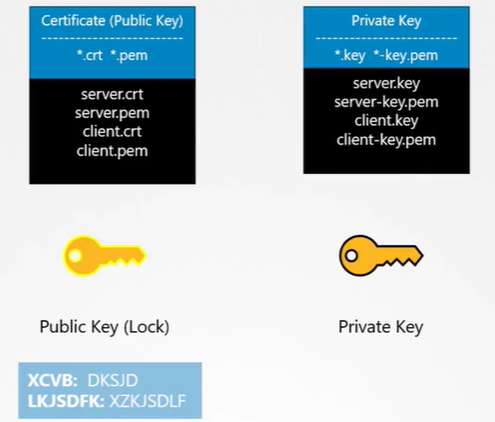
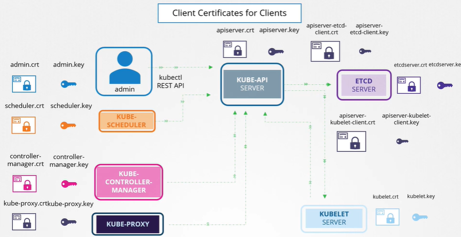
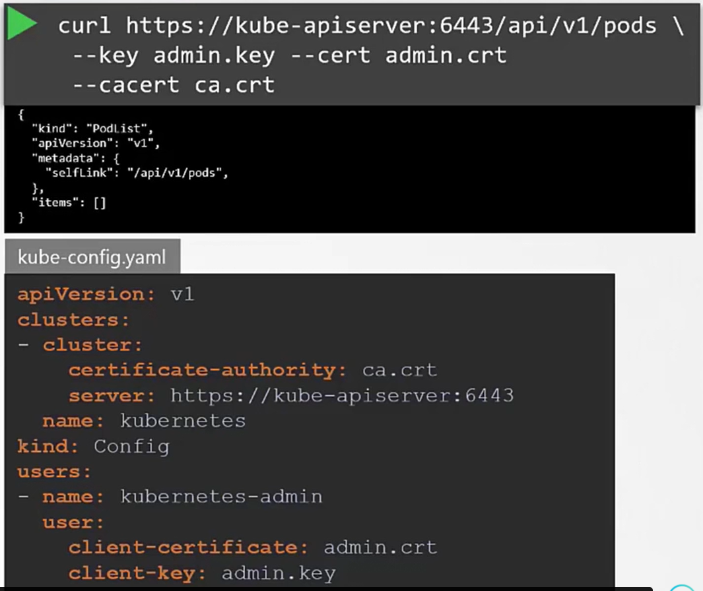
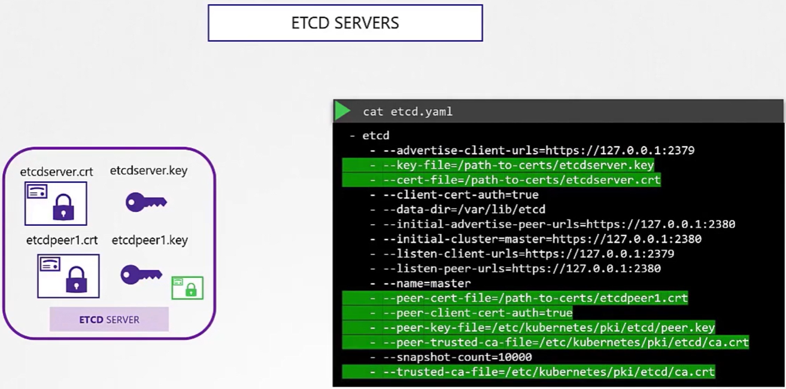
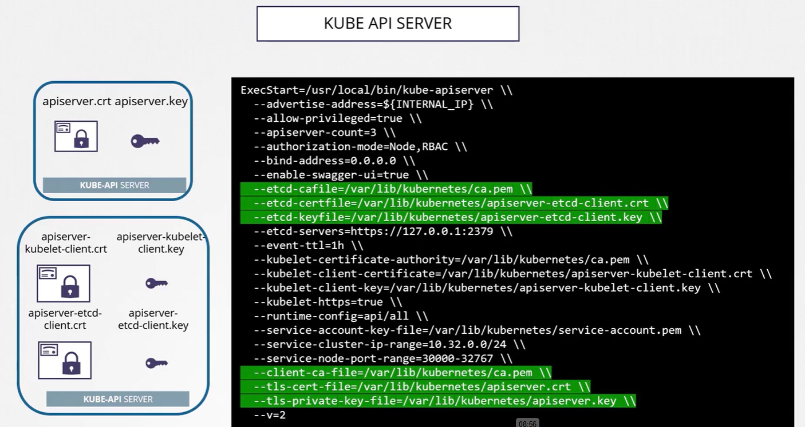
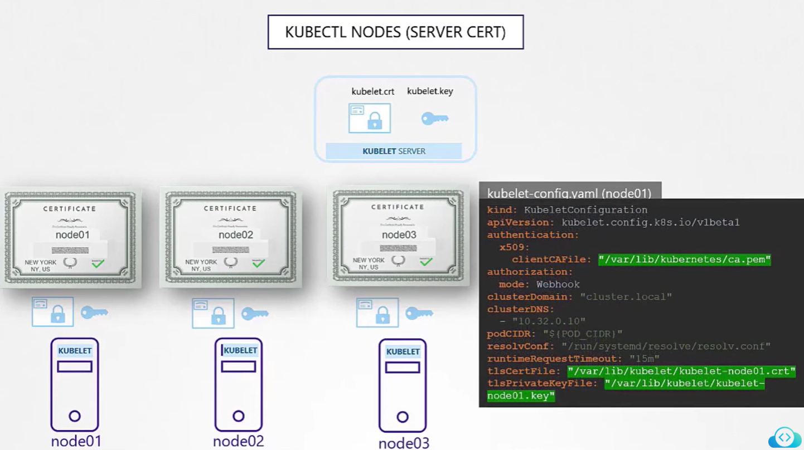
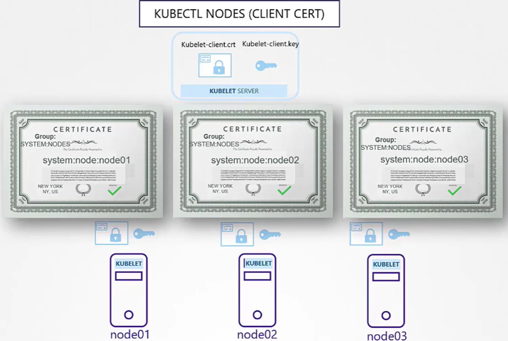

# Cluster setup and hardening

1. [CIS Benchmark and Kube-bench](#cis-benchmark)
2. [Security Primitives](#security-primitives)
   1. [Authentication in Kubernetes](#authentication-in-kubernetes)
      1. [Users (Admins, Developers)](#users-admins-developers)
      2. [Service Accounts](#service-accounts)
   2. [TLS](#tls)
      1. [TLS basics](#tls-basics)
      2. [TLS in kubernetes](#tls-in-kubernetes)


## CIS Benchmark
The Center for Internet Security (CIS) Kubernetes Benchmark provides security recommendations for configuring Kubernetes clusters. This guide helps you implement these recommendations using kube-bench.

Doc: [Download CIS benchamrk guide](https://www.cisecurity.org/cis-benchmarks#kubernetes)

## Kube-bench

Kube-bench is a tool fromt aquasecurity hat checks whether your Kubernetes cluster is deployed according to security best practices defined in the CIS Kubernetes Benchmark.

### 1. Install kube-bench

```shell
# Download the latest version of kube-bench
curl -L https://github.com/aquasecurity/kube-bench/releases/download/v0.10.6/kube-bench_0.10.6_linux_amd64.tar.gz -o kube-bench_0.10.6_linux_amd64.tar.gz

# Extract the files
tar -xvf kube-bench_0.10.6_linux_amd64.tar.gz
```
Ref Setup Documentation: [Download 0.4.0 binary and follow the user guide](https://github.com/aquasecurity/kube-bench/blob/main/docs/installation.md#download-and-install-binaries)

### 2. Run kube-bench

```shell
# Run kube-bench with default configuration
./kube-bench
```

If you need to specify config directories:
```shell
./kube-bench --config-dir `pwd`/cfg --config `pwd`/cfg/config.yaml
```
### 3. Understanding the Results

The scan produces four types of results:
- **[PASS]**: The check was successful
- **[FAIL]**: The check failed and needs remediation
- **[WARN]**: The check needs manual verification or further attention
- **[INFO]**: Informational output only

Example output:
```log
[INFO] 4 Worker Node Security Configuration
[INFO] 4.1 Worker Node Configuration Files
[PASS] 4.1.1 Ensure that the kubelet service file permissions are set to 644 or more restrictive
[FAIL] 4.1.3 Ensure that the proxy configuration file permissions are set to 644 or more restrictive
== Remediations ==
4.1.3 Run the below command on each worker node:
chmod 644 /etc/kubernetes/proxy.conf
== Summary ==
16 checks PASS
1 check FAIL
6 checks WARN
0 checks INFO
```
    
### 4. Fixing Issues

For each FAIL or WARN result, kube-bench provides specific remediation steps:

The Output Report clearly identifies the status (FAIL, WARN, and PASS). For any failed or warning checks, detailed remediation instructions are provided. Simply follow these instructions to address each security issue:

Example:
- **1.3.6** Edit the Controller Manager pod specification file `/etc/kubernetes/manifests/kube-controller-manager.yaml` 
on the master node and add the `--feature-gates` parameter with `RotateKubeletServerCertificate=true`.

Solution:
```shell
vi /etc/kubernetes/manifests/kube-controller-manager.yaml
```

Add or modify the line to include: `--feature-gates=RotateKubeletServerCertificate=true`

### 5. Verify Fixes

After implementing the recommended changes, re-run kube-bench to verify that all issues have been successfully fixed:

```shell
./kube-bench --config-dir `pwd`/cfg --config `pwd`/cfg/config.yaml
```
## Security Primitives

### Authentication in Kubernetes

The `kube-apiserver` functions as the security gatekeeper for the Kubernetes cluster, validating all identities before processing requests. This authentication applies to both human users (administrators, developers) connecting through kubectl or direct API access, and to internal workloads accessing cluster resources through service accounts. All cluster interactions must pass through this authentication layer regardless of origin.


### Users (Admins, Developers)

#### Available Authentication Methods

| Method | Description | Status |
|--------|-------------|--------|
| Static Password File | CSV file with password, username, user ID | Deprecated in v1.19+ |
| Static Token File | CSV file with token, username, user ID | Deprecated in v1.19+ |
| Certificates | X.509 client certificates | Recommended |
| Identity Providers | OIDC, LDAP, etc. | Recommended |


### Static File Authentication (Legacy Method)

> ⚠️ **IMPORTANT:** This authentication method is **DEPRECATED** in Kubernetes v1.19+ and is no longer available in later releases. It is documented here for legacy clusters only.

#### Password File Configuration

1. **File Format** - Create a CSV file with comma-separated values:
   ```
   password,username,user-id[,group1,group2,...]
   ```

2. **Configuration**:
   - For systemd setups: Add `--basic-auth-file=user-details.csv` to the `kube-apiserver.service` file
   - For kubeadm setups: Modify the `kube-apiserver` pod definition file


#### Token File Configuration

Similar to password file, but uses tokens instead of passwords:
- When authenticating via API, pass the token in the Authorization header: `Authorization: Bearer <token>`


### Implementation Guide for kubeadm Setup

1. **Create User Details File**
   ```bash
   # Create directory and file
   mkdir -p /tmp/users/
   cat > /tmp/users/user-details.csv << EOF
   password123,user1,u0001
   password123,user2,u0002
   password123,user3,u0003
   password123,user4,u0004
   password123,user5,u0005
   EOF
   ```

2. **Configure Volume Mount**
   
   Edit `/etc/kubernetes/manifests/kube-apiserver.yaml`:
   ```yaml
    apiVersion: v1
    kind: Pod
    metadata:
    name: kube-apiserver
    namespace: kube-system
    spec:
    containers:
    - command:
        - kube-apiserver
        
        image: k8s.gcr.io/kube-apiserver-amd64:v1.11.3
        name: kube-apiserver
        volumeMounts:
        - mountPath: /tmp/users
        name: usr-details
        readOnly: true
    volumes:
    - hostPath:
        path: /tmp/users
        type: DirectoryOrCreate
        name: usr-details

   ```

3. **Enable Basic Auth**
   
   Add to the kube-apiserver command arguments:
   ```yaml
    apiVersion: v1
    kind: Pod
    metadata:
    creationTimestamp: null
    name: kube-apiserver
    namespace: kube-system
    spec:
    containers:
    - command:
        - kube-apiserver
        - --authorization-mode=Node,RBAC
        
        - --basic-auth-file=/tmp/users/user-details.csv    
   ```

4. **Configure RBAC for Users**

   Create role and role binding:
   ```yaml
    kind: Role
    apiVersion: rbac.authorization.k8s.io/v1
    metadata:
    namespace: default
    name: pod-reader
    rules:
    - apiGroups: # "" indicates the core API group
    resources: ["pods
    verbs: ["get", "watch", "lis

    ---
    # This role binding allows "jane" to read pods in the "default" namespace.
    kind: RoleBinding
    apiVersion: rbac.authorization.k8s.io/v1
    metadata:
    name: read-pods
    namespace: default
    subjects:
    - kind: User
    name: user1 # Name is case sensitive
    apiGroup: rbac.authorization.k8s.io
    roleRef:
    kind: Role #this must be Role or ClusterRole
    name: pod-reader # this must match the name of the Role or ClusterRole you wish to bind to
    apiGroup: rbac.authorization.k8s.io
   ```

5. **Test Authentication**
   ```bash
   curl -v -k https://localhost:6443/api/v1/pods -u "user1:password123"
   ```
### Best Practices

- **Avoid Static Files**: Do not use static password/token files in production environments
- **Prefer Certificates**: Use TLS client certificates for authentication when possible
- **Use Identity Providers**: For larger deployments, integrate with external identity providers
- **Apply RBAC**: Always implement proper Role-Based Access Control after authentication
- **Least Privilege**: Grant users only the permissions they need to perform their tasks

### Service Accounts

Service accounts are Kubernetes resources used by applications to interact with the Kubernetes API. Unlike user accounts which are for humans, service accounts are specifically designed for pods and applications running inside the cluster.


#### Managing Service Accounts

**Service Account Creation:**
```bash
kubectl create serviceaccount dashboard-sa
```

**View Service Accounts:**
```bash
kubectl get serviceaccount
```

#### Service Account Token Handling

##### In Kubernetes v1.22 and Earlier:

When a service account is created, Kubernetes automatically:
1. Creates a token stored in a Secret
2. Links this Secret to the service account

**To inspect a service account:**
```bash
kubectl describe serviceaccount dashboard-sa
```


**To view the token:**
```bash
kubectl describe secret dashboard-sa-token-kbbdm
```


This token can be used as a Bearer token in the Authorization header when making API requests to the Kubernetes API.

**Mounting Tokens to Pods:**
For security, you can mount the service account token as a volume in the pod that needs to use it:


##### Default Service Account

- Every namespace has a `default` service account created automatically
- This default service account is mounted to every pod in the namespace unless specified otherwise
- The default service account has minimal privileges


**To use a custom service account:**
Specify the `serviceAccountName` in the pod spec:

```yaml
apiVersion: v1
kind: Pod
metadata:
  name: my-pod
spec:
  serviceAccountName: dashboard-sa
  containers:
  - name: my-container
    image: nginx
```
#### Assigning Privileges to Service Accounts

To grant a service account specific permissions, you need to create a Role (or ClusterRole) and RoleBinding (or ClusterRoleBinding).

**Example Role and RoleBinding:**
```yaml
# File: pod-reader-role.yaml
kind: Role
apiVersion: rbac.authorization.k8s.io/v1
metadata:
  namespace: default
  name: pod-reader
rules:
- apiGroups:
  - ''
  resources:
  - pods
  verbs:
  - get
  - watch
  - list
---
# File: dashboard-sa-role-binding.yaml
kind: RoleBinding
apiVersion: rbac.authorization.k8s.io/v1
metadata:
  name: read-pods
  namespace: default
subjects:
- kind: ServiceAccount
  name: dashboard-sa # Name is case sensitive
  namespace: default
roleRef:
  kind: Role #this must be Role or ClusterRole
  name: pod-reader # this must match the name of the Role or ClusterRole you wish to bind to
  apiGroup: rbac.authorization.k8s.io
```


> **Note**: You cannot change a pod's service account after creation, you need to delete the pod and re-create it. However, For pods managed by Deployments, updating the service account will trigger a rollout of new pods.

**To disable automatic token mounting:**
```yaml
spec:
  automountServiceAccountToken: false
```

##### In Kubernetes v1.24 and Later:

Service accounts no longer automatically create long-lived tokens in Secrets. Instead, Kubernetes introduced the `TokenRequestAPI` that creates tokens with:
- Specific audience targeting
- Time-bound validity
- Object binding


These tokens have an expiration date:


**Creating Legacy-style Tokens (if needed):**
You can still create non-expiring tokens by manually creating a Secret with the appropriate annotation:

```yaml
apiVersion: v1
kind: Secret
type: kubernetes.io/service-account-token
metadata:
  name: mysecretname
  annotations:
    kubernetes.io/service-account.name: dashboard-sa
```


#### Kubernetes Secret and token Recommendation


### TLS

#### TLS basics

- **Symmetric Encryption**: Uses a single key for both encryption and decryption. It's fast and efficient but requires a secure way to share the key between parties.

- **Asymmetric Encryption**: Uses a pair of mathematically related keys (public and private). The public key can be freely shared and is used to encrypt data, while the private key is kept secret and used to decrypt data. It's more secure for key exchange but slower than symmetric encryption.

- **Certificate Authority (CA)**: A trusted entity that issues digital certificates. The CA verifies the identity of certificate requestors and digitally signs their certificates to establish trust.

- **Digital Certificate**: An electronic document that contains a public key and identity information, signed by a CA to verify authenticity.

- **Certificate Signing Request (CSR)**: A message sent to a CA to request certification of a public key.

- **Public Key Infrastructure (PKI)**: The framework of policies, processes, and technologies that enables secure communication through the management of digital certificates and public keys.

- **TLS Handshake**: The process where two parties authenticate each other and establish a secure communication channel.

**How TLS works:**
1. The server creates a pair of keys (public and private).
2. The server sends a Certificate Signing Request (CSR) with the public key to a Certificate Authority (CA).
3. The CA uses its private key to sign the CSR, and sends back a signed certificate to the server.
4. The server configures the application with both the signed certificate and its private key.
5. When a client accesses the application, the server presents its certificate containing the public key.
6. The client verifies the certificate using the CA's public key (pre-installed in browsers/clients).
7. After verification, the client generates a random symmetric session key.
8. The client encrypts this session key using the server's public key and sends it to the server.
9. The server decrypts the message using its private key to obtain the session key.
10. Both the client and server now use this shared symmetric session key for encrypting subsequent communications.

#### Mutual TLS (mTLS)
For mutual authentication, the above process includes additional steps:
1. The client also possesses its own private key and certificate signed by a trusted CA.
2. After the server presents its certificate, it requests the client's certificate.
3. The client presents its certificate to the server.
4. The server verifies the client's certificate using the corresponding CA's public key.
5. Only if both verifications succeed will the secure connection be established.

Mutual TLS is commonly used in Kubernetes for secure communication between components.

#### Private and Public keys naming convention
A standardized naming convention is used for private keys, public keys, and certificates:

| File Type | Common Extension | Description |
|-----------|------------------|-------------|
| **Private Key** | `.key` | The private portion of a key pair (e.g., `server.key`) that must be kept secure |
| **CSR** | `.csr` | Certificate Signing Request (e.g., `server.csr`) |
| **Public Certificate** | `.crt` or `.pem` | The signed certificate (e.g., `server.crt`) containing the public key |
| **Certificate Bundle** | `.pem` | May contain both certificate and private key |

<p align="center">
    
</p>

### TLS in Kubernetes

#### Kubernetes Components
- **Kube-apiserver**: The front-end API server for the Kubernetes control plane that validates and processes all cluster requests. All communications between cluster components flow through the apiserver.
- **ETCD**: Distributed key-value store that serves as Kubernetes' primary data store, holding all cluster configuration data, state, and metadata.
- **Kube-Controller-Manager**: Runs controller processes that regulate the state of the cluster, ensuring the actual state matches the desired state.
- **Kube-Scheduler**: Assigns pods to nodes based on resource availability and constraints.
- **Kubelet**: An agent running on each node that ensures containers are running in pods according to specifications.
- **Kube-proxy**: Network proxy on each node that maintains network rules and enables pod communication.

<p align="center">
  
</p>

#### Certificate Generation Process

To secure communication between components, we need to generate certificates for each component using a Certificate Authority (CA).

##### 1. Certificate Authority (CA) Setup

```shell
# Generate CA private key
openssl genrsa -out ca.key 2048

# Generate Certificate Signing Request (CSR)
openssl req -new -key ca.key -subj "/CN=KUBERNETES-CA" -out ca.csr

# Self-sign the certificate
openssl x509 -req -in ca.csr -signkey ca.key -out ca.crt
```

The CA certificate (ca.crt) will be used to sign all other component certificates.

##### 2. Client Certificates

###### Admin User Certificate

```shell
# Generate private key
openssl genrsa -out admin.key 2048

# Generate CSR
# CN is the username, O specifies the group (system:masters has admin privileges)
openssl req -new -key admin.key -subj "/CN=kube-admin/O=system:masters" -out admin.csr

# Sign certificate with CA
openssl x509 -req -in admin.csr -CA ca.crt -CAkey ca.key -out admin.crt
```
To use the admin certificates when interacting with the cluster, you need to specify them in your `API requests` or in the `kube-config.yaml` file:

- *API Requests with curl:*

```shell
curl https://kube-apiserver:6443/api/v1/pods \
  --key admin.key \
  --cert admin.crt \
  --cacert ca.crt
```
- *kube-config.yaml:*
```yaml
apiVersion: v1
clusters:
- cluster:
    certificate-authority: ca.crt
    server: https://kube-apiserver:6443
    name: kubernetes
  kind: Config
users:
- name: kubernetes-admin
  user:
    client-certificate: admin.crt
    client-key: admin.key
```
<p align="center">
  
</p>

###### System Component Certificates

For system components (kube-scheduler, kube-controller-manager, etc.), follow the same process but prefix the CN with "system:":

```shell
# Example for kube-scheduler
openssl genrsa -out scheduler.key 2048
openssl req -new -key scheduler.key -subj "/CN=system:kube-scheduler" -out scheduler.csr
openssl x509 -req -in scheduler.csr -CA ca.crt -CAkey ca.key -out scheduler.crt
```

##### 3. Server Certificates

###### ETCD Server

Since ETCD can be deployed across multiple instances as a cluster to ensure high availability, it requires two types of certificates:

1. **Server certificates**: For client-to-server communication
2. **Peer certificates**: For server-to-server communication within the cluster

Both certificate types must be specified in the `etcd.yaml` configuration file:

```shell
# Generate etcd server certificates as above
# Additional peer certificates needed for etcd cluster communication
```

<p align="center">
  
</p>

###### Kube-apiserver Certificate

The apiserver needs a certificate that includes all its possible DNS names and IP addresses:

1. Generate private key:
```shell
openssl genrsa -out apiserver.key 2048
```

2. Create `openssl.cnf` file with Subject Alternative Names (SANs):
```ini
[req]
req_extensions = v3_req
distinguished_name = req_distinguished_name

[v3_req]
basicConstraints = CA:FALSE
keyUsage = nonRepudiation
subjectAltName = @alt_names

[alt_names]
DNS.1 = kubernetes
DNS.2 = kubernetes.default
DNS.3 = kubernetes.default.svc
DNS.4 = kubernetes.default.svc.cluster.local
IP.1 = 10.96.0.1
IP.2 = 172.17.0.87
```

3. Generate CSR using this config:
```shell
openssl req -new -key apiserver.key -subj "/CN=kube-apiserver" -out apiserver.csr --config openssl.cnf
```

4. Sign the certificate:
```shell
openssl x509 -req -in apiserver.csr -CA ca.crt -CAkey ca.key -CAcreateserial \
  -out apiserver.crt -extensions v3_req -extfile openssl.cnf -days 1000
```

<p align="center">
  
</p>

###### Kubelet Server Certificates

Each node requires both server and client certificates:

**Server Certificate**:
- Generate a certificate for each node using the node name in the CN
- Configure in `kubelet-config.yaml`:

```yaml
kind: KubeletConfiguration
apiVersion: kubelet.config.k8s.io/v1beta1
authentication:
  x509:
    clientCAFile: "/var/lib/kubernetes/ca.pem"
  anonymous:
    mode: Webhook
clusterDomain: "cluster.local"
clusterDNS:
  - "10.32.0.10"
podCIDR: "${POD_CIDR}"
resolvConf: "/run/systemd/resolve/resolv.conf"
runtimeRequestTimeout: "15m"
tlsCertFile: "/var/lib/kubelet/kubelet-node01.crt"
tlsPrivateKeyFile: "/var/lib/kubelet/kubelet-node01.key"
```

<p align="center">
  
</p>

**Client Certificate**:
- Generate client certificates for each node with naming convention `system:node:<node-name>`
- Include group `/O=system:nodes` in the CSR

<p align="center">
  
</p>