# Cluster setup and hardening

1. [CIS Benchmark and Kube-bench](#cis-benchmark)
2. [Security Primitives](#security-primitives)
   1. [Authentication in Kubernetes](#authentication-in-kubernetes)
      1. [Users (Admins, Developers)](#users-admins-developers)
      2. [Service Accounts](#service-accounts)

## CIS Benchmark
The Center for Internet Security (CIS) Kubernetes Benchmark provides security recommendations for configuring Kubernetes clusters. This guide helps you implement these recommendations using kube-bench.

Doc: [Download CIS benchamrk guide](https://www.cisecurity.org/cis-benchmarks#kubernetes)

## Kube-bench

Kube-bench is a tool fromt aquasecurity hat checks whether your Kubernetes cluster is deployed according to security best practices defined in the CIS Kubernetes Benchmark.

### 1. Install kube-bench

```shell
# Download the latest version of kube-bench
curl -L https://github.com/aquasecurity/kube-bench/releases/download/v0.10.6/kube-bench_0.10.6_linux_amd64.tar.gz -o kube-bench_0.10.6_linux_amd64.tar.gz

# Extract the files
tar -xvf kube-bench_0.10.6_linux_amd64.tar.gz
```
Ref Setup Documentation: [Download 0.4.0 binary and follow the user guide](https://github.com/aquasecurity/kube-bench/blob/main/docs/installation.md#download-and-install-binaries)

### 2. Run kube-bench

```shell
# Run kube-bench with default configuration
./kube-bench
```

If you need to specify config directories:
```shell
./kube-bench --config-dir `pwd`/cfg --config `pwd`/cfg/config.yaml
```
### 3. Understanding the Results

The scan produces four types of results:
- **[PASS]**: The check was successful
- **[FAIL]**: The check failed and needs remediation
- **[WARN]**: The check needs manual verification or further attention
- **[INFO]**: Informational output only

Example output:
```log
[INFO] 4 Worker Node Security Configuration
[INFO] 4.1 Worker Node Configuration Files
[PASS] 4.1.1 Ensure that the kubelet service file permissions are set to 644 or more restrictive
[FAIL] 4.1.3 Ensure that the proxy configuration file permissions are set to 644 or more restrictive
== Remediations ==
4.1.3 Run the below command on each worker node:
chmod 644 /etc/kubernetes/proxy.conf
== Summary ==
16 checks PASS
1 check FAIL
6 checks WARN
0 checks INFO
```
    
### 4. Fixing Issues

For each FAIL or WARN result, kube-bench provides specific remediation steps:

The Output Report clearly identifies the status (FAIL, WARN, and PASS). For any failed or warning checks, detailed remediation instructions are provided. Simply follow these instructions to address each security issue:

Example:
- **1.3.6** Edit the Controller Manager pod specification file `/etc/kubernetes/manifests/kube-controller-manager.yaml` 
on the master node and add the `--feature-gates` parameter with `RotateKubeletServerCertificate=true`.

Solution:
```shell
vi /etc/kubernetes/manifests/kube-controller-manager.yaml
```

Add or modify the line to include: `--feature-gates=RotateKubeletServerCertificate=true`

### 5. Verify Fixes

After implementing the recommended changes, re-run kube-bench to verify that all issues have been successfully fixed:

```shell
./kube-bench --config-dir `pwd`/cfg --config `pwd`/cfg/config.yaml
```
## Security Primitives

### Authentication in Kubernetes

The `kube-apiserver` functions as the security gatekeeper for the Kubernetes cluster, validating all identities before processing requests. This authentication applies to both human users (administrators, developers) connecting through kubectl or direct API access, and to internal workloads accessing cluster resources through service accounts. All cluster interactions must pass through this authentication layer regardless of origin.

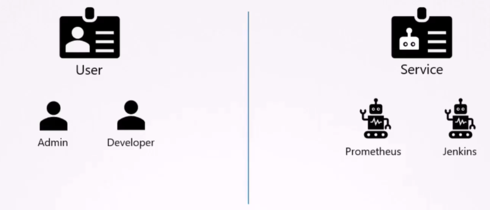

### Users (Admins, Developers)

#### Available Authentication Methods

| Method | Description | Status |
|--------|-------------|--------|
| Static Password File | CSV file with password, username, user ID | Deprecated in v1.19+ |
| Static Token File | CSV file with token, username, user ID | Deprecated in v1.19+ |
| Certificates | X.509 client certificates | Recommended |
| Identity Providers | OIDC, LDAP, etc. | Recommended |

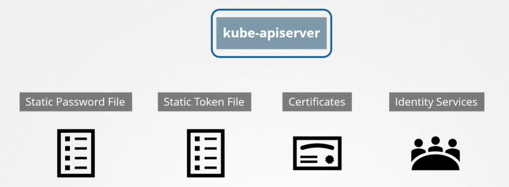

### Static File Authentication (Legacy Method)

> ⚠️ **IMPORTANT:** This authentication method is **DEPRECATED** in Kubernetes v1.19+ and is no longer available in later releases. It is documented here for legacy clusters only.

#### Password File Configuration

1. **File Format** - Create a CSV file with comma-separated values:
   ```
   password,username,user-id[,group1,group2,...]
   ```

2. **Configuration**:
   - For systemd setups: Add `--basic-auth-file=user-details.csv` to the `kube-apiserver.service` file
   - For kubeadm setups: Modify the `kube-apiserver` pod definition file

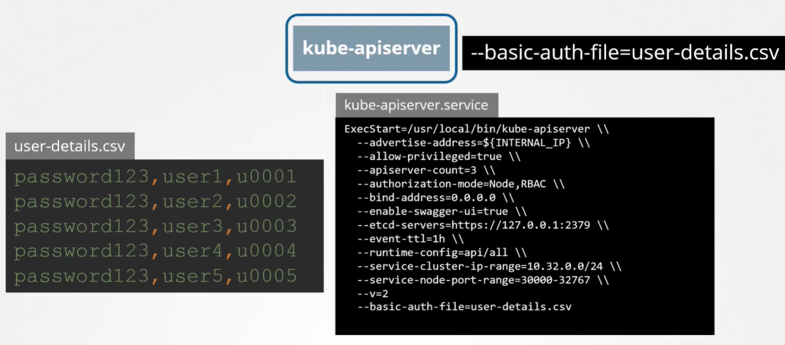

#### Token File Configuration

Similar to password file, but uses tokens instead of passwords:
- When authenticating via API, pass the token in the Authorization header: `Authorization: Bearer <token>`

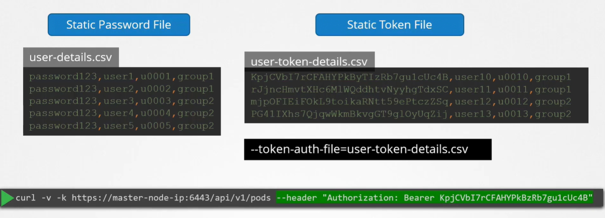

### Implementation Guide for kubeadm Setup

1. **Create User Details File**
   ```bash
   # Create directory and file
   mkdir -p /tmp/users/
   cat > /tmp/users/user-details.csv << EOF
   password123,user1,u0001
   password123,user2,u0002
   password123,user3,u0003
   password123,user4,u0004
   password123,user5,u0005
   EOF
   ```

2. **Configure Volume Mount**
   
   Edit `/etc/kubernetes/manifests/kube-apiserver.yaml`:
   ```yaml
    apiVersion: v1
    kind: Pod
    metadata:
    name: kube-apiserver
    namespace: kube-system
    spec:
    containers:
    - command:
        - kube-apiserver
        
        image: k8s.gcr.io/kube-apiserver-amd64:v1.11.3
        name: kube-apiserver
        volumeMounts:
        - mountPath: /tmp/users
        name: usr-details
        readOnly: true
    volumes:
    - hostPath:
        path: /tmp/users
        type: DirectoryOrCreate
        name: usr-details

   ```

3. **Enable Basic Auth**
   
   Add to the kube-apiserver command arguments:
   ```yaml
    apiVersion: v1
    kind: Pod
    metadata:
    creationTimestamp: null
    name: kube-apiserver
    namespace: kube-system
    spec:
    containers:
    - command:
        - kube-apiserver
        - --authorization-mode=Node,RBAC
        
        - --basic-auth-file=/tmp/users/user-details.csv    
   ```

4. **Configure RBAC for Users**

   Create role and role binding:
   ```yaml
    kind: Role
    apiVersion: rbac.authorization.k8s.io/v1
    metadata:
    namespace: default
    name: pod-reader
    rules:
    - apiGroups: # "" indicates the core API group
    resources: ["pods
    verbs: ["get", "watch", "lis

    ---
    # This role binding allows "jane" to read pods in the "default" namespace.
    kind: RoleBinding
    apiVersion: rbac.authorization.k8s.io/v1
    metadata:
    name: read-pods
    namespace: default
    subjects:
    - kind: User
    name: user1 # Name is case sensitive
    apiGroup: rbac.authorization.k8s.io
    roleRef:
    kind: Role #this must be Role or ClusterRole
    name: pod-reader # this must match the name of the Role or ClusterRole you wish to bind to
    apiGroup: rbac.authorization.k8s.io
   ```

5. **Test Authentication**
   ```bash
   curl -v -k https://localhost:6443/api/v1/pods -u "user1:password123"
   ```
### Best Practices

- **Avoid Static Files**: Do not use static password/token files in production environments
- **Prefer Certificates**: Use TLS client certificates for authentication when possible
- **Use Identity Providers**: For larger deployments, integrate with external identity providers
- **Apply RBAC**: Always implement proper Role-Based Access Control after authentication
- **Least Privilege**: Grant users only the permissions they need to perform their tasks

### Service Accounts

Service accounts are Kubernetes resources used by applications to interact with the Kubernetes API. Unlike user accounts which are for humans, service accounts are specifically designed for pods and applications running inside the cluster.

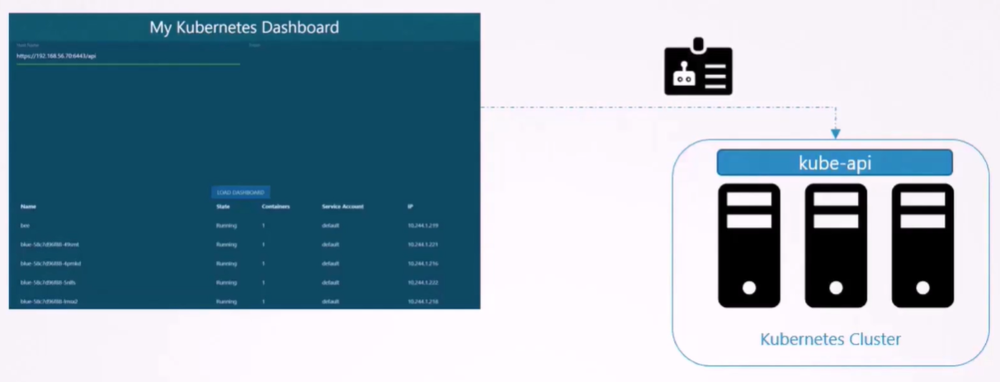

#### Managing Service Accounts

**Service Account Creation:**
```bash
kubectl create serviceaccount dashboard-sa
```

**View Service Accounts:**
```bash
kubectl get serviceaccount
```

#### Service Account Token Handling

##### In Kubernetes v1.22 and Earlier:

When a service account is created, Kubernetes automatically:
1. Creates a token stored in a Secret
2. Links this Secret to the service account

**To inspect a service account:**
```bash
kubectl describe serviceaccount dashboard-sa
```

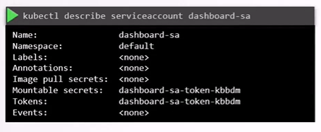

**To view the token:**
```bash
kubectl describe secret dashboard-sa-token-kbbdm
```

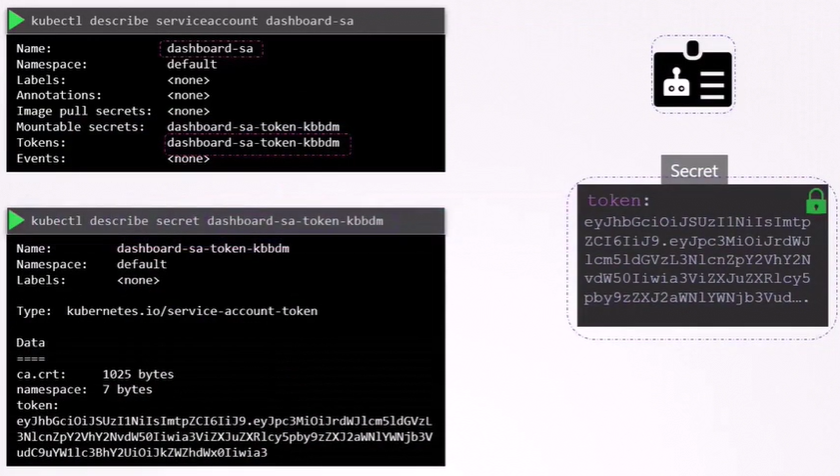

This token can be used as a Bearer token in the Authorization header when making API requests to the Kubernetes API.

**Mounting Tokens to Pods:**
For security, you can mount the service account token as a volume in the pod that needs to use it:

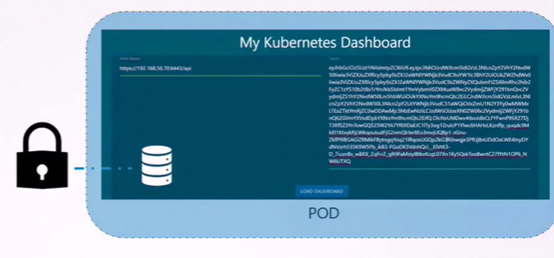

##### Default Service Account

- Every namespace has a `default` service account created automatically
- This default service account is mounted to every pod in the namespace unless specified otherwise
- The default service account has minimal privileges

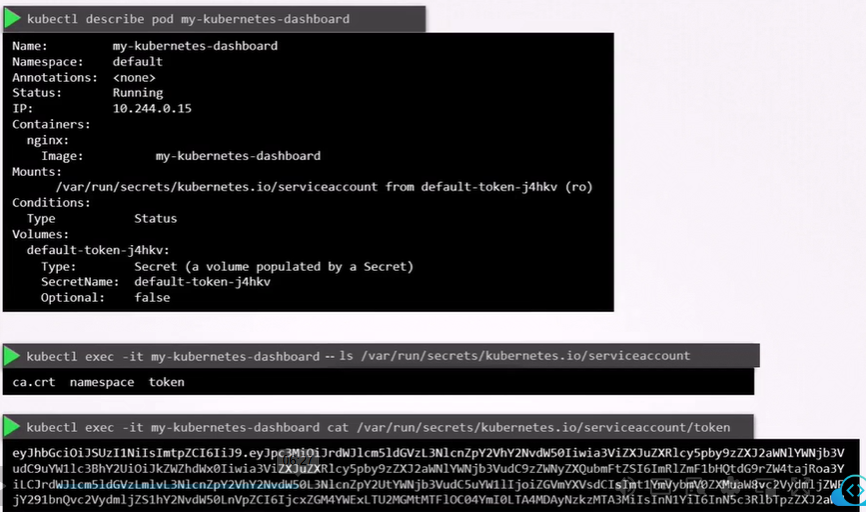

**To use a custom service account:**
Specify the `serviceAccountName` in the pod spec:

```yaml
apiVersion: v1
kind: Pod
metadata:
  name: my-pod
spec:
  serviceAccountName: dashboard-sa
  containers:
  - name: my-container
    image: nginx
```

> **Note**: You cannot change a pod's service account after creation, you need to delete the pod and re-create it. However, For pods managed by Deployments, updating the service account will trigger a rollout of new pods.

**To disable automatic token mounting:**
```yaml
spec:
  automountServiceAccountToken: false
```

##### In Kubernetes v1.24 and Later:

Service accounts no longer automatically create long-lived tokens in Secrets. Instead, Kubernetes introduced the `TokenRequestAPI` that creates tokens with:
- Specific audience targeting
- Time-bound validity
- Object binding

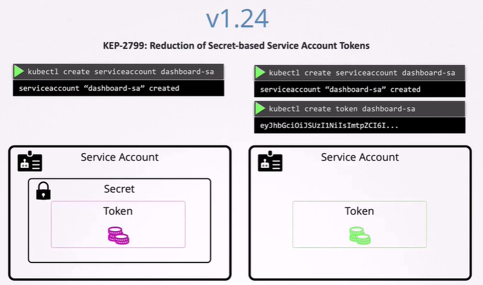

These tokens have an expiration date:
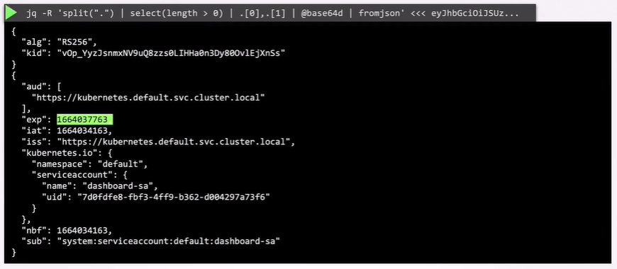

**Creating Legacy-style Tokens (if needed):**
You can still create non-expiring tokens by manually creating a Secret with the appropriate annotation:

```yaml
apiVersion: v1
kind: Secret
type: kubernetes.io/service-account-token
metadata:
  name: mysecretname
  annotations:
    kubernetes.io/service-account.name: dashboard-sa
```

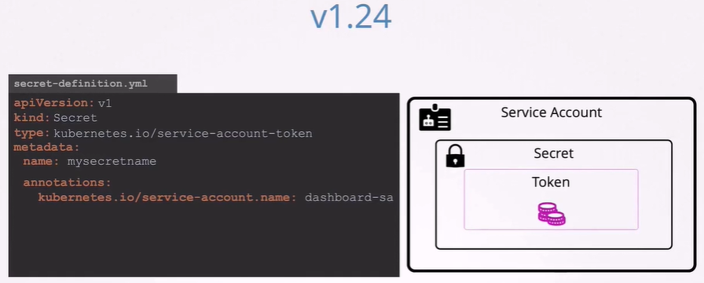

#### Kubernetes Secret and token Recommendation

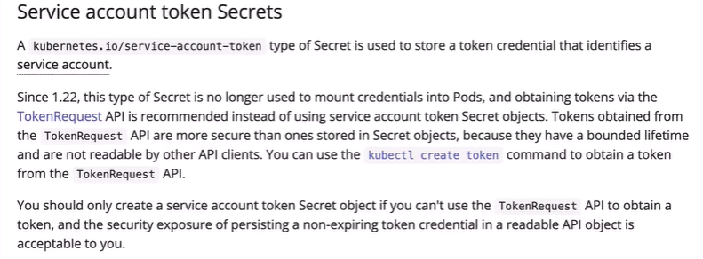

